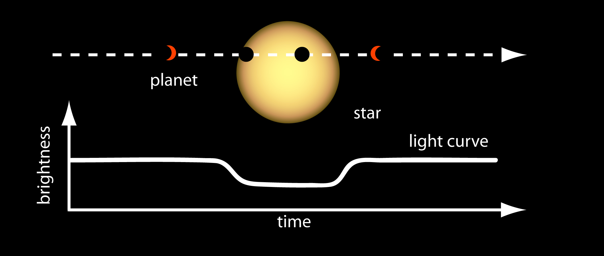

# EXOTIC (EXOplanet Transit Interpretation Code)
A python 3 package for reducing photometric data of transiting exoplanets into lightcurves, and retrieving transit epochs and planetary radii

## Overview
The EXOplanet Transit Interpretation Code relies upon the transit method for exoplanet detection. This method detects exoplanets by measuring the dimming of a star as an orbiting planet transits, which is when it passes between its host star and the Earth. If we record the host star’s emitted light, known as the flux, and observe how it changes as a function of time, we should observe a small dip in the brightness when a transit event occurs. A graph of host star flux vs. time is known as a lightcurve, and it holds the key to determining how large the planet is, and how long it will be until it transits again.

The objective of this pipeline is to help you reduce your images of your transiting exoplanet into a lightcurve, and fit a model to your data to extract planetary information that is crucial to increasing the efficiency of larger observational platforms, and futhering our astronomical knowledge.

## Instructions
This section contains the link to the complete instructions for how to run EXOTIC. The document outlines how to install the necessary packages and dependencies, as well as how to use the pipeline once it's running. 

To demonstrate how to use the data reduction pipeline, the linked document above will walk through a sample reduction of a dataset taken by a 6” telescope of the exoplanet HAT-P-32b (VMag = 11.44) observed on December 20, 2017. The corresponding explanation of the science behind the reduction mechanism can be found in the How it Works section. 

The telescope used to collect this dataset is part of the MicroObservatory Robotic Telescope Network operated by the Harvard-Smithsonian Center for Astrophysics.

## How it Works

This section contains the link to the document that explains the science underlying the reduction mechanism and the light curve fitting routine, as well a guide on how to interpret the results. It is reccomended that you read through the How-EXOTIC-Works before attempting to reduce a dataset, because it provides an explanation of the plots the code produces.

A resulting lightcurve from the sample dataset is shown below:

## References
Zellem et. al 2019, Eastman et al. 2013, Mandel and Agol 2002, Eastman et al. 2010, Winn et al. 2010

Lightcurve model developed by Dr. Gael Roudier.
Photometry tools developed by Kyle Pearson.
Additional features and bug fixes added by Rob Zellem and John Engelke.
Documentation co-written by Alexandra Iturralde.

## Citation
If you use any of these algorithms in your work, please include Ethan H. Blaser as a coauthor. Current Institution: University of Virginia, Charlottesville, Virginia 22904, USA