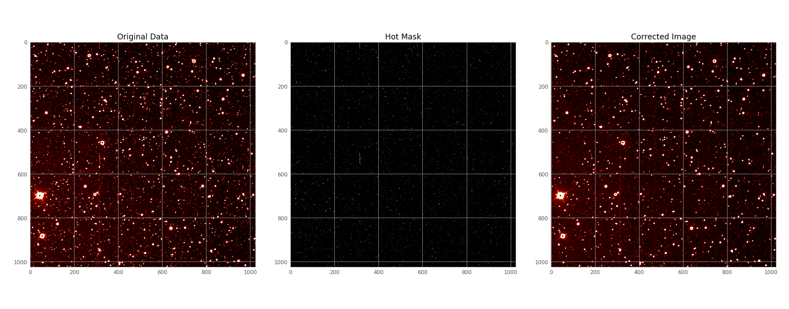

# EXOTIC (EXOplanet Transit Interpretation Code)

[](https://pypi.python.org/pypi/exotic/)
[](https://github.com/rzellem/EXOTIC/blob/main/LICENSE)
[](https://ui.adsabs.harvard.edu/abs/2020PASP..132e4401Z/abstract/)

A Python 3 package for analyzing photometric data of transiting exoplanets into lightcurves and retrieving transit epochs and planetary radii.

The EXOplanet Transit Interpretation Code relies upon the [transit method](https://exoplanets.nasa.gov/alien-worlds/ways-to-find-a-planet/#/2) for exoplanet detection. This method detects exoplanets by measuring the dimming of a star as an orbiting planet transits, which is when it passes between its host star and the Earth. If we record the host star’s emitted light, known as the flux, and observe how it changes as a function of time, we should observe a small dip in the brightness when a transit event occurs. A graph of host star flux vs. time is known as a lightcurve, and it holds the key to determining how large the planet is, and how long it will be until it transits again.


(NASA Ames)

The objective of this pipeline is to help you reduce your images of your transiting exoplanet into a lightcurve, and fit a model to your data to extract planetary information that is crucial to increasing the efficiency of larger observational platforms, and futhering our astronomical knowledge.

## New Users
Below are the instructions for installing and running EXOTIC for the first time. However, if you are a new user, we recommend you follow the "How to Run EXOTIC Locally on your Computer using the Sample Data" tutorial, which includes detailed installation instructions, on our website under ["How to Analyze Your Exoplanet Observations"](https://exoplanets.nasa.gov/exoplanet-watch/how-to-contribute/how-to-reduce-your-data/).

## Installation and Running

EXOTIC can run on a Windows, Macintosh, or Linux/Unix computer. You can also use EXOTIC via the free Google Colab, which features cloud computing, many helpful plotting functions, and a simplified installation. However, if you are a user with many images or large images, we recommend running EXOTIC locally on your own computer.

 **Google Colab Cloud**
  - Features: does not require the user to install any software locally on their own computer.
  - Limitations: Requires user to upload their images to a free Gdrive account.
  - Recommendations: If you run out of space on your default Google/Gdrive account, you can sign up for a new, free account to use. Some users even make a new Google account for every new dataset to avoid running out of space.
  - [How to use EXOTIC on the Colab video](https://drive.google.com/file/d/10zlQRgT8iV3dSe0FVW7tiL-V86ewai_1/view)
  - [How to use EXOTIC on the Colab written instructions](http://docs.google.com/document/d/1GLnfX1DdGPpd1ArKNcoF2GGV6pwKR3aEYuwjSQlhiZQ/edit?usp=sharing)
  - [EXOTIC: Google Colab Cloud Version](https://colab.research.google.com/drive/1UcDfm3z1WnfdOpRwjCQYwDgK9Wh2cU6x?usp=sharing) (includes step-by-step instructions)
  

 **Locally On Your Own Computer**
  - Features: Images are read off of the user's harddrive- nothing is uploaded to Gdrive. This method can be helpful for those with large filesizes, many files, or a slow internet connection.
  - Limitations: Requires user to install Python3 and multiple subpackages.
  
  - Installation Instructions:
    1. ​[Download and install the latest release of Python.](https://www.python.org/downloads/)
        **NOTE FOR WINDOWS USERS:** make sure to check the box "Add Python to PATH" when installing.
        **NOTE FOR ALL USERS:** please download and install the latest release of Python, even if you have a previous installation already on your computer, to ensure that all Python packages are properly installed.
    2. [Download the latest release of EXOTIC.](https://github.com/rzellem/EXOTIC/releases)
    3. Unzip this file.
    4. Double-click on the appropriate installer for your operating system:
        - Windows: run_exotic_windows.bat
        - Macintosh: run_exotic_macintosh.command
        - Linux: run_exotic_linux.sh
    5. If you get a security warning about the software being from an unidentified, unsigned, or non-trusted developer, you can bypass it by:
        - Windows: click "More info" and then the "Run away" box at the bottom of the window.
        - Macintosh: Please follow [these instructions](https://support.apple.com/guide/mac-help/open-a-mac-app-from-an-unidentified-developer-mh40616/mac).

- **We also recommend that you download our [sample transiting exoplanet dataset](https://github.com/rzellem/EXOTIC_sampledata)** to confirm that EXOTIC is running correctly on the Google Colab Cloud or your own computer.
- How EXOTIC Works
  - [Document](https://github.com/rzellem/EXOTIC/blob/main/Documentation/English/How-EXOTIC-Works.pdf)
  - [Video](https://drive.google.com/file/d/1x0kl8WtpEw9wS0JInbjVWvdzuTc9TTvS/view)

- Lastly, we offer these documents [in other languages](https://github.com/rzellem/EXOTIC/raw/main/Documentation/)

## Requirements
FITS files with a modern header including parameters for UT time, exposure time, WCS coordinations (optional) are required for EXOTIC.

## Sample Data and Outputs
We provide a [sample dataset](https://github.com/rzellem/EXOTIC_sampledata/releases/) consisting of 142 `fits` files taken by a 6” telescope of the exoplanet HAT-P-32 b (V-mag = 11.44) observed on December 20, 2017. The telescope used to collect this dataset is part of the [MicroObservatory Robotic Telescope Network](http://microobservatory.org) operated by the Harvard-Smithsonian Center for Astrophysics.

[Sample Data](https://github.com/rzellem/EXOTIC_sampledata/releases/)

A lightcurve from the sample dataset is shown below:


For the full output of EXOTIC please see the [example output](https://github.com/rzellem/EXOTIC/raw/main/Documentation/English/example_output.txt)

```
*********************************************************
FINAL PLANETARY PARAMETERS

          Mid-Transit Time [BJD_TDB]: 2458107.71406 +/- 0.00097
  Radius Ratio (Planet/Star) [Rp/Rs]: 0.1541 +/- 0.0033
           Transit depth [(Rp/Rs)^2]: 2.37 +/- 0.1 [%]
 Semi Major Axis/ Star Radius [a/Rs]: 5.213 +/- 0.061
               Airmass coefficient 1: 1.1626 +/- 0.0037
               Airmass coefficient 2: -0.1184 +/- 0.0024
                    Residual scatter: 0.55 %
                 Best Comparison Star: None
                    Optimal Aperture: 4.09
                     Optimal Annulus: 10.74
              Transit Duration [day]: 0.13 +/- 0.0017
*********************************************************

```

## Initializaton File

Get EXOTIC up and running faster with a json file. Please see the included file ([inits.json](inits.json)) meant for the [sample data](https://github.com/rzellem/EXOTIC_sampledata). The initialization file has the following fields:

```json
{
    "user_info": {
            "Directory with FITS files": "sample-data/HatP32Dec202017",
            "Directory to Save Plots": "sample-data/",
            "Directory of Flats": null,
            "Directory of Darks": null,
            "Directory of Biases": null,

            "AAVSO Observer Code (blank if none)": "RTZ",
            "Secondary Observer Codes (blank if none)": "",

            "Observation date": "17-December-2017",
            "Obs. Latitude": "+32.41638889",
            "Obs. Longitude": "-110.73444444",
            "Obs. Elevation (meters)": 2616,
            "Camera Type (CCD or DSLR)": "CCD",
            "Pixel Binning": "1x1",
            "Filter Name (aavso.org/filters)": "V",
            "Observing Notes": "Weather, seeing was nice.",

            "Plate Solution? (y/n)": "y",

            "Target Star X & Y Pixel": [424, 286],
            "Comparison Star(s) X & Y Pixel": [[465, 183], [512, 263], [], [], [], [], [], [], [], []]
    },
    "planetary_parameters": {
            "Target Star RA": "02:04:10",
            "Target Star Dec": "+46:41:23",
            "Planet Name": "HAT-P-32 b",
            "Host Star Name": "HAT-P-32",
            "Orbital Period (days)": 2.1500082,
            "Orbital Period Uncertainty": 1.3e-07,
            "Published Mid-Transit Time (BJD-UTC)": 2455867.402743,
            "Mid-Transit Time Uncertainty": 4.9e-05,
            "Ratio of Planet to Stellar Radius (Rp/Rs)": 0.14886235252742716,
            "Ratio of Planet to Stellar Radius (Rp/Rs) Uncertainty": 0.0005539487393037134,
            "Ratio of Distance to Stellar Radius (a/Rs)": 5.344,
            "Ratio of Distance to Stellar Radius (a/Rs) Uncertainty": 0.039496835316262996,
            "Orbital Inclination (deg)": 88.98,
            "Orbital Inclination (deg) Uncertainty": 0.7602631123499285,
            "Orbital Eccentricity (0 if null)": 0.159,
            "Star Effective Temperature (K)": 6001.0,
            "Star Effective Temperature (+) Uncertainty": 88.0,
            "Star Effective Temperature (-) Uncertainty": -88.0,
            "Star Metallicity ([FE/H])": -0.16,
            "Star Metallicity (+) Uncertainty": 0.08,
            "Star Metallicity (-) Uncertainty": -0.08,
            "Star Surface Gravity (log(g))": 4.22,
            "Star Surface Gravity (+) Uncertainty": 0.04,
            "Star Surface Gravity (-) Uncertainty": -0.04
    },
    "optional_info": {
            "Pre-reduced File:": "/sample-data/NormalizedFlux_HAT-P-32 b_December 17, 2017.txt",
            "Pre-reduced File Time Format (BJD_TDB, JD_UTC, MJD_UTC)": "BJD_TDB",
            "Pre-reduced File Units of Flux (flux, magnitude, millimagnitude)": "flux",

            "Filter Minimum Wavelength (nm)": null,
            "Filter Maximum Wavelength (nm)": null,

            "Pixel Scale (Ex: 5.21 arcsecs/pixel)": null,

            "Exposure Time (s)": 60.0
    }
}
```

## Features and Pipeline Architecture

- Automatic Plate Solution from http://nova.astrometry.net

- Resolve targets with [NASA Exoplanet Archive](https://exoplanetarchive.ipac.caltech.edu/) + retrieve light curve priors

- Hot Pixel Masking



- Aperture Photometry with PSF centroiding (2D Gaussian + rotation)


- Stellar masking in background estimate


- Multiple comparison star + aperture size optimization

- Non-linear 4 parameter limb darkening with [LDTK](https://github.com/hpparvi/ldtk)

- Light curve parameter optimization with [Nested Sampling](https://dynesty.readthedocs.io/en/latest/index.html)


## Contributing to EXOTIC

EXOTIC is an open source project that welcomes contributions. Please fork the repository and submit a pull request to the develop branch for your addition(s) to be reviewed.

## Citation
If you use any of these algorithms in your work, please cite our 2020 paper: [Zellem, Pearson, Blaser, et al. 2020](https://ui.adsabs.harvard.edu/abs/2020arXiv200309046Z/abstract)

Please also include the following statement in your paper's Acknowledgements section:
>This publication makes use of data products from Exoplanet Watch, a citizen science project managed by NASA’s Jet Propulsion Laboratory on behalf of NASA’s Universe of Learning. This work is supported by NASA under award number NNX16AC65A to the Space Telescope Science Institute.

## Exoplanet Watch
 

Contribute to [Exoplanet Watch](https://exoplanets.nasa.gov/exoplanet-watch/about-exoplanet-watch/), a citizen science project that improves the properties of exoplanets and their orbits using observations processed with EXOTIC. Register with [AAVSO](https://www.aavso.org/exoplanet-section) and input your Observer Code to help track your contributions allowing for proper credit on future publications using those measurements. Ask about our Exoplanet Watch Slack Channel!

## Acknowledgements
Exoplanet Watch is a project by NASA's Universe of Learning. NASA's Universe of Learning materials are based upon work supported by NASA under award number NNX16AC65A to the Space Telescope Science Institute, working in partnership with Caltech/IPAC, Center for Astrophysics | Harvard & Smithsonian, and the Jet Propulsion Laboratory.
