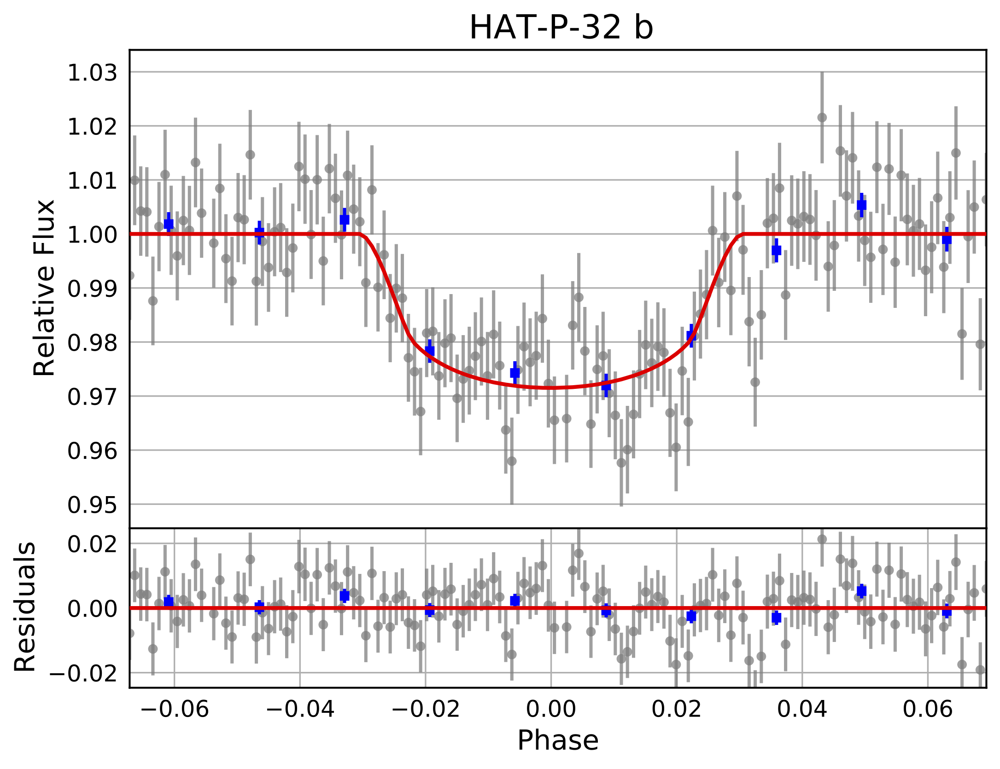

# EXOTIC (EXOplanet Transit Interpretation Code)
A python 3 package for reducing photometric data of transiting exoplanets into lightcurves, and retrieving transit epochs and planetary radii.

## Overview
The EXOplanet Transit Interpretation Code relies upon the transit method for exoplanet detection. This method detects exoplanets by measuring the dimming of a star as an orbiting planet transits, which is when it passes between its host star and the Earth. If we record the host star’s emitted light, known as the flux, and observe how it changes as a function of time, we should observe a small dip in the brightness when a transit event occurs. A graph of host star flux vs. time is known as a lightcurve, and it holds the key to determining how large the planet is, and how long it will be until it transits again.


The objective of this pipeline is to help you reduce your images of your transiting exoplanet into a lightcurve, and fit a model to your data to extract planetary information that is crucial to increasing the efficiency of larger observational platforms, and futhering our astronomical knowledge.

## Installation Instructions

The easiest way to install exotic is with pip: 

`pip install exotic`

**Depending on your version of python you may need to use a different pip command (e.g. pip3).** If you're having trouble installing exotic from pip then you can try to install from this git repo: 

```
git clone https://github.com/rzellem/EXOTIC.git
cd exotic
python setup.py install
```

For additional installation instructions including setting up dependencies please see the following documents for [Mac](Documentation/English/EXOTIC-Installation-Instructions-for-Mac-Users.pdf), [Windows](Documentation/English/EXOTIC-Installation-Instructions-for-Windows-Users.pdf) and [Linux](exotic_installation_linux.sh)

## Running exotic

To demonstrate how to use the data reduction pipeline, the linked document above will walk through a sample reduction of a dataset taken by a 6” telescope of the exoplanet HAT-P-32 b (VMag = 11.44) observed on December 20, 2017. The corresponding explanation of the science behind the reduction mechanism can be found in the How it Works section. 

The telescope used to collect this dataset is part of the MicroObservatory Robotic Telescope Network operated by the Harvard-Smithsonian Center for Astrophysics.


A resulting lightcurve from the sample dataset is shown below:



## How it Works


For more information on the core functionality of EXOTIC: [link](Documentation/English/EXOTIC-Installation-Instructions-for-Mac-Users.pdf)


## Contributing to EXOTIC / Reporting a bug

Please create an issue on GitHub and a track the changes with a new branch that has the same name as the issue number. 

## Citation
If you use any of these algorithms in your work, please cite our 2020 paper: [Zellem, Pearson, Blaser, et al. 2020](https://ui.adsabs.harvard.edu/abs/2020arXiv200309046Z/abstract) 
