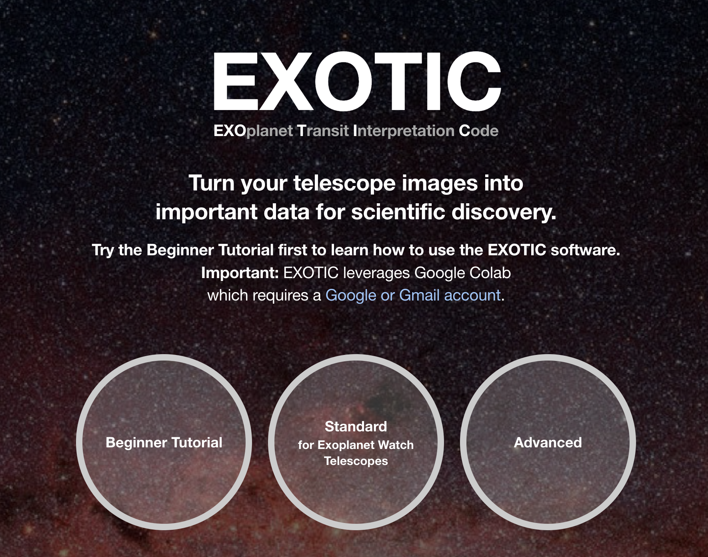
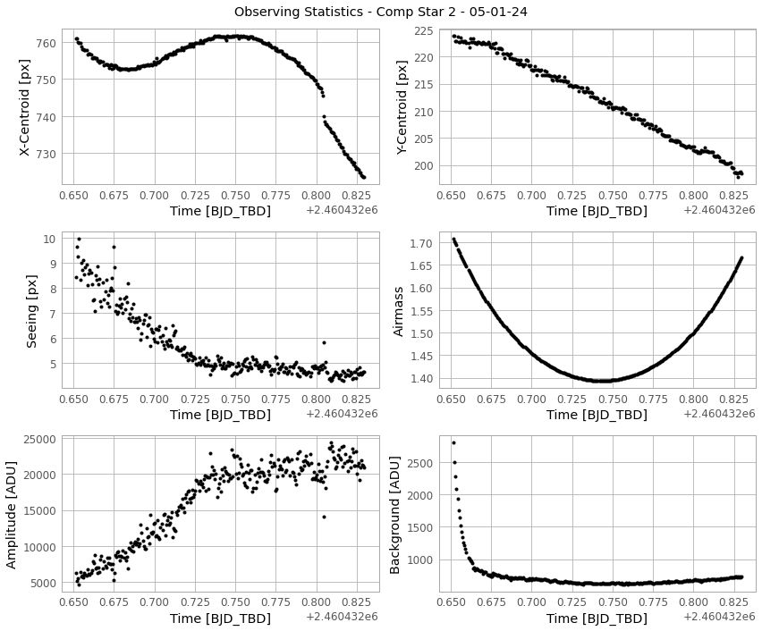
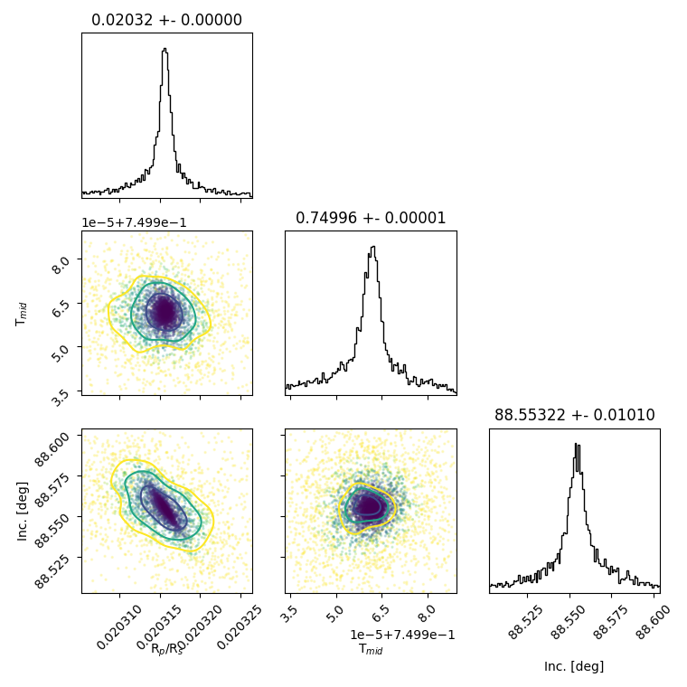

# EXOTIC (EXOplanet Transit Interpretation Code)

[](https://pypi.python.org/pypi/exotic/)
[](https://github.com/rzellem/EXOTIC/blob/main/LICENSE)
[](https://ui.adsabs.harvard.edu/abs/2020PASP..132e4401Z/abstract/)
[](https://join.slack.com/t/uol-ets/shared_invite/zt-2khgvlo2a-hcFH0S7aVIDT28_NMTOgWQ)
[](https://colab.research.google.com/drive/1CNRbMQC0FmiVC9Pxj_lUhThgXqgbrVB_)
[](https://hf.co/chat/assistant/66c0cb652a9c7710cec9341c)


A Python 3 package for reducing and analyzing photometric data of exoplanetary transits. As an exoplanet passes in front of its host star, the observed brightness of the star drops by a small amount. This drop in brightness is known as a [transit]((https://exoplanets.nasa.gov/alien-worlds/ways-to-find-a-planet/#/2)). Our software aids in creating lightcurves from images, enabling extraction of planetary parameters (e.g. Rp/Rs, Inclination, Mid-transit, etc.) through fitting astrophysical models to the data. 


(NASA Ames)

## Installation + Setup

To install EXOTIC, you need to have Python 3.10 or lower installed on your computer. You can then install EXOTIC by following these steps:

1. Install [Anaconda](https://www.anaconda.com/products/distribution) or [Miniconda](https://docs.conda.io/en/latest/miniconda.html) (a minimal version of Anaconda) on your computer.
2. Create a new virtual environment and activate it:

   ```
   conda create -n exotic python=3.10
   conda activate exotic
   ```
3. Install EXOTIC and its dependencies:
   ```
   pip install exotic
   ```
5. (Optional) Run EXOTIC's graphical user interface (GUI):
   ```
   exotic-gui
   ```

After installing EXOTIC, you can verify the installation by running the following command in your terminal or command prompt:

```
python -c "import exotic"
```

If EXOTIC is installed correctly, you should not see any error messages. You can now start using EXOTIC by following the [examples](https://github.com/rzellem/EXOTIC/tree/main/examples) provided in the repository or by using our [sample dataset](https://github.com/rzellem/EXOTIC_sampledata/releases/). **If you're a new user**, we recommend starting with the beginner tutorial in Google Colab and then following our installation instructions for your operating system.

## Google Colab Cloud

Google Colab is a free cloud service that allows you to run Python code in a Jupyter notebook environment without having to install any software on your computer. We have a series of tutorials that you can run in Google Colab to learn how to use EXOTIC. You can access these tutorials by clicking on the following links:
- [Beginner Tutorial](https://colab.research.google.com/drive/1Xxx7XAwgRhtV7VmxpE1Jsb3SUumsZjWR) for getting started with [sample data](https://github.com/rzellem/EXOTIC_sampledata/releases/)
- [Standard Tutorial](https://colab.research.google.com/drive/1CNRbMQC0FmiVC9Pxj_lUhThgXqgbrVB_) for people who use data from MicroObservatory robotic telescopes (we can give you [data](https://exoplanets.nasa.gov/exoplanet-watch/how-to-contribute/data-checkout/) to convert to a light curve)
- [Advanced Tutorial](https://colab.research.google.com/drive/1_954Ec5bWeAH9r8xAxRZ1EmhF_03xVfe) for people who use observations from their own telescope

If those links are broken check our [website](https://exoplanets.nasa.gov/exoplanet-watch/exotic/welcome/) for the latest.

[](https://exoplanets.nasa.gov/exoplanet-watch/exotic/welcome/)

## New User Tutorials

The user community behind [Exoplanet Watch](https://exoplanets.nasa.gov/exoplanet-watch/about-exoplanet-watch/overview/) has created extensive documentation to help you get started with EXOTIC. We recommend you start with the following resources:

- [Installation instructions](https://github.com/rzellem/EXOTIC/tree/main/docs) for Windows, Mac, and Linux.
- [How to use EXOTIC on the Colab (video)](https://drive.google.com/file/d/10zlQRgT8iV3dSe0FVW7tiL-V86ewai_1/view)
- [How to use EXOTIC on the Colab](http://docs.google.com/document/d/1GLnfX1DdGPpd1ArKNcoF2GGV6pwKR3aEYuwjSQlhiZQ/edit?usp=sharing)
- [EXOTIC Tutorial (video)](https://drive.google.com/file/d/1x0kl8WtpEw9wS0JInbjVWvdzuTc9TTvS/view)
- [Exoplanet Watch Observer's Manual](https://docs.google.com/document/d/1KrGKRElbA8VG98quocr6QRUeLtKtrjW4pgX8o1BXDjw/edit?usp=sharing)
- [AI Chatbot for Exoplanet Watch](https://hf.co/chat/assistant/66c0cb652a9c7710cec9341c)
- These documents [in other languages](https://github.com/rzellem/EXOTIC/tree/main/docs/regions)

## Sample Data
We recommend you test exotic with a [sample dataset](https://github.com/rzellem/EXOTIC_sampledata/releases/) consisting of 142 `fits` files taken by a 6” telescope of the exoplanet HAT-P-32 b (V-mag = 11.44) observed on December 20, 2017. The telescope used to collect this dataset is part of the [MicroObservatory Robotic Telescope Network](http://microobservatory.org) operated by the Harvard-Smithsonian Center for Astrophysics.

A lightcurve from the sample dataset is shown below:


Exotic will output the final parameters in a text file and a plot of the light curve. The output will look similar to the following:

```
*********************************************************
FINAL PLANETARY PARAMETERS

          Mid-Transit Time [BJD_TDB]: 2458107.71406 +/- 0.00097
  Radius Ratio (Planet/Star) [Rp/Rs]: 0.1541 +/- 0.0033
           Transit depth [(Rp/Rs)^2]: 2.37 +/- 0.1 [%]
 Semi Major Axis/ Star Radius [a/Rs]: 5.213 +/- 0.061
               Airmass coefficient 1: 1.1626 +/- 0.0037
               Airmass coefficient 2: -0.1184 +/- 0.0024
                    Residual scatter: 0.55 %
                 Best Comparison Star: None
                    Optimal Aperture: 4.09
                     Optimal Annulus: 10.74
              Transit Duration [day]: 0.13 +/- 0.0017
*********************************************************

```

## Initializaton File

Get EXOTIC up and running faster with a json file. Please see the included file ([inits.json](inits.json)) meant for the [sample data](https://github.com/rzellem/EXOTIC_sampledata). The initialization file has the following fields:

```json
{
    "user_info": {
            "Directory with FITS files": "sample-data/HatP32Dec202017",
            "Directory to Save Plots": "sample-data/",
            "Directory of Flats": null,
            "Directory of Darks": null,
            "Directory of Biases": null,

            "AAVSO Observer Code (blank if none)": "RTZ",
            "Secondary Observer Codes (blank if none)": "",

            "Observation date": "17-December-2017",
            "Obs. Latitude": "+32.41638889",
            "Obs. Longitude": "-110.73444444",
            "Obs. Elevation (meters)": 2616,
            "Camera Type (CCD or DSLR)": "CCD",
            "Pixel Binning": "1x1",
            "Filter Name (aavso.org/filters)": "V",
            "Observing Notes": "Weather, seeing was nice.",

            "Plate Solution? (y/n)": "y",

            "Target Star X & Y Pixel": [424, 286],
            "Comparison Star(s) X & Y Pixel": [[465, 183], [512, 263], [], [], [], [], [], [], [], []]
    },
    "planetary_parameters": {
            "Target Star RA": "02:04:10",
            "Target Star Dec": "+46:41:23",
            "Planet Name": "HAT-P-32 b",
            "Host Star Name": "HAT-P-32",
            "Orbital Period (days)": 2.1500082,
            "Orbital Period Uncertainty": 1.3e-07,
            "Published Mid-Transit Time (BJD-UTC)": 2455867.402743,
            "Mid-Transit Time Uncertainty": 4.9e-05,
            "Ratio of Planet to Stellar Radius (Rp/Rs)": 0.14886235252742716,
            "Ratio of Planet to Stellar Radius (Rp/Rs) Uncertainty": 0.0005539487393037134,
            "Ratio of Distance to Stellar Radius (a/Rs)": 5.344,
            "Ratio of Distance to Stellar Radius (a/Rs) Uncertainty": 0.039496835316262996,
            "Orbital Inclination (deg)": 88.98,
            "Orbital Inclination (deg) Uncertainty": 0.7602631123499285,
            "Orbital Eccentricity (0 if null)": 0.159,
            "Star Effective Temperature (K)": 6001.0,
            "Star Effective Temperature (+) Uncertainty": 88.0,
            "Star Effective Temperature (-) Uncertainty": -88.0,
            "Star Metallicity ([FE/H])": -0.16,
            "Star Metallicity (+) Uncertainty": 0.08,
            "Star Metallicity (-) Uncertainty": -0.08,
            "Star Surface Gravity (log(g))": 4.22,
            "Star Surface Gravity (+) Uncertainty": 0.04,
            "Star Surface Gravity (-) Uncertainty": -0.04
    },
    "optional_info": {
            "Pre-reduced File:": "/sample-data/NormalizedFlux_HAT-P-32 b_December 17, 2017.txt",
            "Pre-reduced File Time Format (BJD_TDB, JD_UTC, MJD_UTC)": "BJD_TDB",
            "Pre-reduced File Units of Flux (flux, magnitude, millimagnitude)": "flux",

            "Filter Minimum Wavelength (nm)": null,
            "Filter Maximum Wavelength (nm)": null,

            "Pixel Scale (Ex: 5.21 arcsecs/pixel)": null,

            "Exposure Time (s)": 60.0
    }
}
```

## Features and Pipeline Architecture

- Automatic Plate Solution from http://nova.astrometry.net

- Resolve targets with [NASA Exoplanet Archive](https://exoplanetarchive.ipac.caltech.edu/) + retrieve light curve priors

- Hot Pixel Masking

- Image to image alignment for centroid tracking

- Optimal Aperture Photometry

- PSF Photometry



- Stellar masking in background estimate


- Multiple comparison star + aperture size optimization

- Non-linear 4 parameter limb darkening with [LDTK](https://github.com/hpparvi/ldtk). For a list of compatible filters please see: [filters.py](https://github.com/rzellem/EXOTIC/blob/main/exotic/api/filters.py)

- Light curve parameter optimization with [Nested Sampling](https://johannesbuchner.github.io/UltraNest/readme.html)



## Contributing to EXOTIC

EXOTIC is an open source project that welcomes contributions. Please fork the repository and submit a pull request to the `develop` branch and join our slack channel to get ahold of our team. We are always looking for new contributors to help us improve the software and documentation.

## Citation
If you use any of these algorithms in your work, please cite our 2020 paper: [Zellem, Pearson, Blaser, et al. 2020](https://ui.adsabs.harvard.edu/abs/2020arXiv200309046Z/abstract)

Please also include the following statement in your paper's Acknowledgements section:
>This publication makes use of data products from Exoplanet Watch, a citizen science project managed by NASA’s Jet Propulsion Laboratory on behalf of NASA’s Universe of Learning. This work is supported by NASA under award number NNX16AC65A to the Space Telescope Science Institute.

## Exoplanet Watch
[](https://exoplanets.nasa.gov/exoplanet-watch/how-to-contribute/checklist/)

Contribute to [Exoplanet Watch](https://exoplanets.nasa.gov/exoplanet-watch/about-exoplanet-watch/), a citizen science project that improves the properties of exoplanets and their orbits using observations processed with EXOTIC. Register with [AAVSO](https://www.aavso.org/exoplanet-section) and input your Observer Code to help track your contributions allowing for proper credit on future publications using those measurements. Ask about our Exoplanet Watch Slack Channel!

## Acknowledgements
Exoplanet Watch is a project by NASA's Universe of Learning. NASA's Universe of Learning materials are based upon work supported by NASA under award number NNX16AC65A to the Space Telescope Science Institute, working in partnership with Caltech/IPAC, Center for Astrophysics | Harvard & Smithsonian, and the Jet Propulsion Laboratory.
