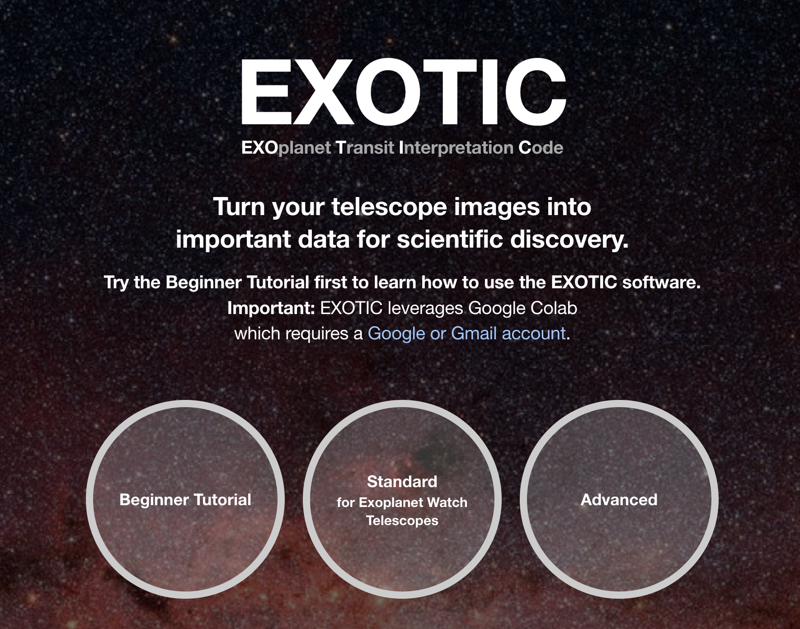
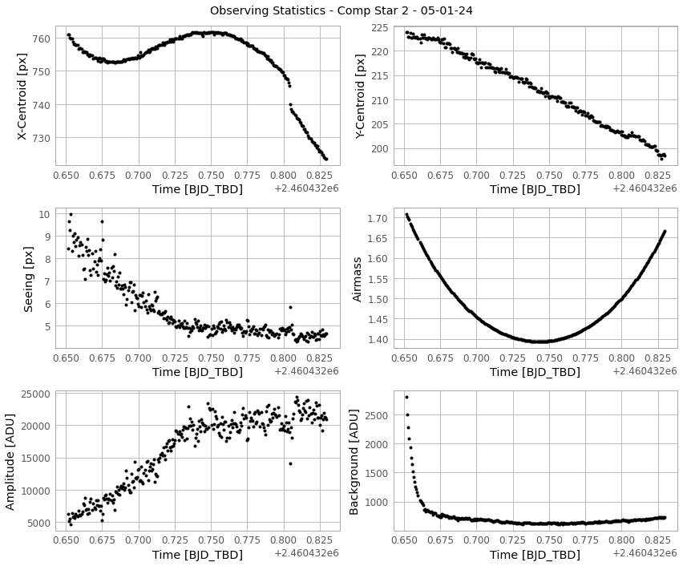
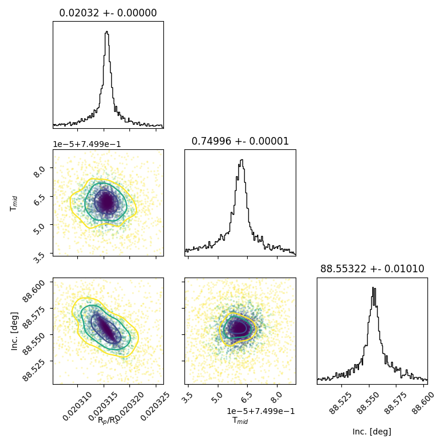

# EXOTIC (EXOplanet Transit Interpretation Code)

[](https://pypi.python.org/pypi/exotic/)
[](https://github.com/rzellem/EXOTIC/blob/main/LICENSE)
[](https://ui.adsabs.harvard.edu/abs/2020PASP..132e4401Z/abstract/)
[](https://join.slack.com/t/uol-ets/shared_invite/zt-2khgvlo2a-hcFH0S7aVIDT28_NMTOgWQ)
[](https://colab.research.google.com/drive/1CNRbMQC0FmiVC9Pxj_lUhThgXqgbrVB_)
[](https://hf.co/chat/assistant/66c0cb652a9c7710cec9341c)


A Python 3 package for reducing and analyzing photometric data of exoplanetary transits. As an exoplanet passes in front of its host star, the observed brightness of the star drops by a small amount. This drop in brightness is known as a [transit]((https://exoplanets.nasa.gov/alien-worlds/ways-to-find-a-planet/#/2)). Our software aids in creating lightcurves from images, enabling extraction of planetary parameters (e.g. Rp/Rs, Inclination, Mid-transit, etc.) through fitting astrophysical models to the data. 


(NASA Ames)

## Installation + Setup

To install EXOTIC, use Python 3.12 or newer. Python 3.13 is tested and recommended. You can then install EXOTIC by following these steps:

1. Install [Anaconda](https://www.anaconda.com/products/distribution) or [Miniconda](https://docs.conda.io/en/latest/miniconda.html) (a minimal version of Anaconda) on your computer.
2. Create a new virtual environment and activate it:

   ```
   conda create -n exotic python=3.13
   conda activate exotic
   ```
3. Install EXOTIC and its dependencies:
   ```
   pip install exotic
   ```
4. MPI support is optional but recommended when your computer already has a compatible MPI runtime, or when you have permission to install one. It can support MPI-aware work in UltraNest and LDTk, but ordinary EXOTIC reductions run normally without it. EXOTIC detects working MPI support automatically; no EXOTIC setting is required. If an MPI runtime is available but `mpi4py` is not already installed, add the optional Python bindings with:
   ```
   pip install "exotic[mpi]"
   ```
   If you cannot install system software, skip this step; no core EXOTIC reduction capability is removed.
5. (Optional) Run EXOTIC's graphical user interface (GUI):
   ```
   exotic-gui
   ```

After installing EXOTIC, you can verify the installation by running the following command in your terminal or command prompt:

```
python -c "import exotic"
```

If EXOTIC is installed correctly, you should not see any error messages. You can now start using EXOTIC by following the [examples](https://github.com/rzellem/EXOTIC/tree/main/examples) provided in the repository or by using our [sample dataset](https://github.com/rzellem/EXOTIC_sampledata/releases/). **If you're a new user**, we recommend starting with the beginner tutorial in Google Colab and then following our installation instructions for your operating system.

## Google Colab Cloud

Google Colab is a free cloud service that allows you to run Python code in a Jupyter notebook environment without having to install any software on your computer. We have a series of tutorials that you can run in Google Colab to learn how to use EXOTIC. You can access these tutorials by clicking on the following links:
- [Beginner Tutorial](https://colab.research.google.com/drive/1Xxx7XAwgRhtV7VmxpE1Jsb3SUumsZjWR) for getting started with [sample data](https://github.com/rzellem/EXOTIC_sampledata/releases/)
- [Standard Tutorial](https://colab.research.google.com/drive/1CNRbMQC0FmiVC9Pxj_lUhThgXqgbrVB_) for people who use data from MicroObservatory robotic telescopes (we can give you [data](https://exoplanets.nasa.gov/exoplanet-watch/how-to-contribute/data-checkout/) to convert to a light curve)
- [Advanced Tutorial](https://colab.research.google.com/drive/1_954Ec5bWeAH9r8xAxRZ1EmhF_03xVfe) for people who use observations from their own telescope

If those links are broken check our [website](https://exoplanets.nasa.gov/exoplanet-watch/exotic/welcome/) for the latest.

[](https://exoplanets.nasa.gov/exoplanet-watch/exotic/welcome/)

## New User Tutorials

The user community behind [Exoplanet Watch](https://exoplanets.nasa.gov/exoplanet-watch/about-exoplanet-watch/overview/) has created extensive documentation to help you get started with EXOTIC. We recommend you start with the following resources:

- [Installation instructions](https://github.com/rzellem/EXOTIC/tree/main/docs) for Windows, Mac, and Linux.
- [How to use EXOTIC on the Colab (video)](https://drive.google.com/file/d/10zlQRgT8iV3dSe0FVW7tiL-V86ewai_1/view)
- [How to use EXOTIC on the Colab](http://docs.google.com/document/d/1GLnfX1DdGPpd1ArKNcoF2GGV6pwKR3aEYuwjSQlhiZQ/edit?usp=sharing)
- [EXOTIC Tutorial (video)](https://drive.google.com/file/d/1x0kl8WtpEw9wS0JInbjVWvdzuTc9TTvS/view)
- [Exoplanet Watch Observer's Manual](https://docs.google.com/document/d/1KrGKRElbA8VG98quocr6QRUeLtKtrjW4pgX8o1BXDjw/edit?usp=sharing)
- [AI Chatbot for Exoplanet Watch](https://hf.co/chat/assistant/66c0cb652a9c7710cec9341c)
- These documents [in other languages](https://github.com/rzellem/EXOTIC/tree/main/docs/regions)

## Sample Data
We recommend you test exotic with a [sample dataset](https://github.com/rzellem/EXOTIC_sampledata/releases/) consisting of 142 `fits` files taken by a 6” telescope of the exoplanet HAT-P-32 b (V-mag = 11.44) observed on December 20, 2017. The telescope used to collect this dataset is part of the [MicroObservatory Robotic Telescope Network](http://microobservatory.org) operated by the Harvard-Smithsonian Center for Astrophysics.

A lightcurve from the sample dataset is shown below:


Exotic will output the final parameters in a text file and a plot of the light curve. The output will look similar to the following:

```
*********************************************************
FINAL PLANETARY PARAMETERS

          Mid-Transit Time [BJD_TDB]: 2458107.71406 +/- 0.00097
  Radius Ratio (Planet/Star) [Rp/Rs]: 0.1541 +/- 0.0033
           Transit depth [(Rp/Rs)^2]: 2.37 +/- 0.1 [%]
 Semi Major Axis/ Star Radius [a/Rs]: 5.213 +/- 0.061
               Airmass coefficient 1: 1.1626 +/- 0.0037
               Airmass coefficient 2: -0.1184 +/- 0.0024
                    Residual scatter: 0.55 %
                 Best Comparison Star: None
                    Optimal Aperture: 4.09
                     Optimal Annulus: 10.74
              Transit Duration [day]: 0.13 +/- 0.0017
*********************************************************

```

## Initializaton File

Get EXOTIC up and running faster with a json file. Please see the included file ([inits.json](inits.json)) meant for the [sample data](https://github.com/rzellem/EXOTIC_sampledata). The initialization file has the following fields:

```json
{
    "user_info": {
            "Directory with FITS files": "sample-data/HatP32Dec202017",
            "Directory to Save Plots": "sample-data/",
            "Directory of Flats": null,
            "Directory of Darks": null,
            "Directory of Biases": null,

            "AAVSO Observer Code (blank if none)": "RTZ",
            "Secondary Observer Codes (blank if none)": "",
            "Observatory Full Title": "",

            "Observation date": "17-December-2017",
            "Obs. Latitude": "+32.41638889",
            "Obs. Longitude": "-110.73444444",
            "Obs. Elevation (meters)": 2616,
            "Camera Type (CCD or DSLR)": "CCD",
            "Pixel Binning": "1x1",
            "Filter Name (aavso.org/filters)": "V",
            "Observing Notes": "Weather, seeing was nice.",

            "Plate Solution? (y/n)": true,

            "Target Star X & Y Pixel": [424, 286],
            "Comparison Star(s) X & Y Pixel": [[465, 183], [512, 263], [], [], [], [], [], [], [], []],
            "Comparison Star(s) RA & Dec": null
    },
    "planetary_parameters": {
            "Target Star RA": "02:04:10",
            "Target Star Dec": "+46:41:23",
            "Planet Name": "HAT-P-32 b",
            "Host Star Name": "HAT-P-32",
            "Orbital Period (days)": 2.1500082,
            "Orbital Period Uncertainty": 1.3e-07,
            "Published Mid-Transit Time (BJD-UTC)": 2455867.402743,
            "Mid-Transit Time Uncertainty": 4.9e-05,
            "Ratio of Planet to Stellar Radius (Rp/Rs)": 0.14886235252742716,
            "Ratio of Planet to Stellar Radius (Rp/Rs) Uncertainty": 0.0005539487393037134,
            "Ratio of Distance to Stellar Radius (a/Rs)": 5.344,
            "Ratio of Distance to Stellar Radius (a/Rs) Uncertainty": 0.039496835316262996,
            "Orbital Inclination (deg)": 88.98,
            "Orbital Inclination (deg) Uncertainty": 0.7602631123499285,
            "Orbital Eccentricity (0 if null)": 0.159,
            "Star Effective Temperature (K)": 6001.0,
            "Star Effective Temperature (+) Uncertainty": 88.0,
            "Star Effective Temperature (-) Uncertainty": -88.0,
            "Star Metallicity ([FE/H])": -0.16,
            "Star Metallicity (+) Uncertainty": 0.08,
            "Star Metallicity (-) Uncertainty": -0.08,
            "Star Surface Gravity (log(g))": 4.22,
            "Star Surface Gravity (+) Uncertainty": 0.04,
            "Star Surface Gravity (-) Uncertainty": -0.04
    },
    "optional_info": {
            "Pre-reduced File:": "/sample-data/NormalizedFlux_HAT-P-32 b_December 17, 2017.txt",
            "Pre-reduced File Time Format (BJD_TDB, JD_UTC, MJD_UTC)": "BJD_TDB",
            "Pre-reduced File Units of Flux (flux, magnitude, millimagnitude)": "flux",

            "Filter Minimum Wavelength (nm)": null,
            "Filter Maximum Wavelength (nm)": null,

            "Fast Aperture Mask (y/n)": false,
            "allow_pixel_alignment_fallback": true,
            "prefer_pixel_values_over_wcs_for_target": false,
            "use_psf_photometry": true,
            "use_aperture_photometry": true,
            "use_aperture_corrections_and_full_image_fwhm": false,
            "use_ensemble_photometry_rather_than_single_comp": false,
            "stellar_variability_only": false,
            "use_ensemble_photometry_for_stellar_variability": true,
            "require_apparent_magnitudes": true,
            "use_exactly_the_comps_provided": false,
            "maximum_number_of_ensemble_comparisons_for_transit": 5,
            "maximum_number_of_ensemble_comparisons_for_stellar_variability": 5,
            "photometer_fortuitous_variables": true,
            "use_single_comparison_for_fortuitous_variables": true,
            "use_nextastro_vsx_cache_first": false,
            "skip_low_comparison_coverage_rejection": false,
            "fit_lightcurve_to_every_comparison_candidate": false,
            "detrend_on_outoftransit_baseline": true,
            "final_fit_baseline_duration_multiplier": 1.0,
            "restrict_baseline_to_an_hour": true,
            "use_eebls_to_initialize_tmid_and_bounds": true,
            "pick_comparison_by_eebls_snr": true,
            "use_impactparameter_rather_than_inclination_to_fit": true,
            "Use target-driven comp selection rather than comp-driven comp selection": false,
            "require_comp_star": true,

            "Pixel Scale (Ex: 5.21 arcsecs/pixel)": null,

            "Exposure Time (s)": 60.0
    }
}
```

### Comparison-star mode tags

Put these tags in the top-level `"optional_info"` object. JSON booleans (`true` and `false`) are recommended. Every initialization boolean also accepts numeric `1`/`0` and case-insensitive strings `"y"`/`"n"`, `"yes"`/`"no"`, `"true"`/`"false"`, and `"on"`/`"off"`.

With `"restrict_baseline_to_an_hour": true` (the default), EXOTIC still measures every valid frame but fits only frames from one hour before ingress through one hour after egress. Frames outside that window that survive the ordinary pre-fit sigma/raw-ratio clipping are shown in blue in the `Diagnostics/FullDataFullLightCurve` plot; the canonical `FinalLightCurve` shows the fitted black points, red rejection crosses, and model without the blue baseline overlay. Frames rejected by the ordinary pre-fit clipping passes remain excluded from the fit but are retained as red crosses in both plots for traceability.

For raw-image reductions, bias, dark, and flat calibration frames are combined through temporary disk-backed stacks so full-resolution calibration sets do not need to reside in RAM at once. When calibration frames are supplied, the resulting `MasterBias.fits`, `MasterDark.fits`, and `MasterFlat.fits` products are saved in the run's output directory and copied beside the light-science images with `CALTYPE`, `NINPUT`, and `NCOMBINE` metadata. On later runs, those canonical files are detected automatically (and excluded from the science-image list) and loaded directly, so the raw calibration stacks do not need to be rebuilt. A user may also provide a canonical master file directly in a calibration input field.

Raw-image reductions prefer per-frame WCS when WCS coverage is consistent across the dataset. With the default `"allow_pixel_alignment_fallback": true`, EXOTIC uses `"bad_wcs_threshold_percent"` to choose the safe path: sparse missing-WCS frames below the threshold are dropped and the retained sequence remains WCS-based; when the missing-WCS fraction reaches or exceeds the threshold, all frames are retained and legacy pixel alignment is available for frames without usable WCS. Set `"allow_pixel_alignment_fallback": false` to require WCS-only processing and drop every frame without celestial WCS. The existing `"Ignore WCS in Header and Do Manual Alignment? (y/n)": "y"` option explicitly enables pixel alignment for the entire run.

Comparison stars may be supplied in `user_info` using either `"Comparison Star(s) X & Y Pixel"` or `"Comparison Star(s) RA & Dec"`. Do not populate both. RA/Dec values may be decimal degrees, such as `[[31.04125, 46.68972]]`, or sexagesimal strings, such as `[["02:04:09.90", "+46:41:23.0"]]`. Sexagesimal values must be quoted because they are JSON strings; forms such as `[[02:04:09.90, +46:41:23.0]]` are not valid JSON. Supplied X/Y positions are converted to sky coordinates with the reference frame's WCS; during photometry those sky coordinates are projected independently through every retained frame's own WCS header.

| Reduction | Requested comparison mode | `optional_info` settings |
|---|---|---|
| Transit fit | Single comparison star (default) | `"stellar_variability_only": false`, `"require_comp_star": true`, `"use_ensemble_photometry_rather_than_single_comp": false` |
| Transit fit | Comparison-star ensemble | `"stellar_variability_only": false`, `"require_comp_star": true`, `"use_ensemble_photometry_rather_than_single_comp": true`, `"maximum_number_of_ensemble_comparisons_for_transit": 5` |
| Transit or variability run | Exactly the supplied comparison(s) | `"use_exactly_the_comps_provided": true`. Comparisons may be supplied as X/Y or RA/Dec. One supplied comparison is used alone; two or more are all used as one fixed ensemble. Automatic replacement, addition, VSX/stability vetting, ranking, and ensemble-size limiting are bypassed. |
| Transit fit | No comparison star | There is no tag that forces this mode. `"require_comp_star": false` only removes the requirement for a comparison star; it does not force target-only photometry. The current comparison-calibration FITS path still selects a single comparison or an ensemble. |
| Stellar-variability-only run | Single comparison star | `"stellar_variability_only": true`, `"use_ensemble_photometry_for_stellar_variability": false` |
| Stellar-variability-only run | Calibrated comparison-star ensemble (default) | `"stellar_variability_only": true`, `"use_ensemble_photometry_for_stellar_variability": true`, `"maximum_number_of_ensemble_comparisons_for_stellar_variability": 5` |
| Stellar-variability-only run | No comparison star | Not supported for raw-FITS absolute variability photometry; a single calibrated comparison or calibrated ensemble is required. A pre-reduced relative light curve can be supplied without raw comparison-star photometry, but it is not selected by a comparison-mode tag. |

The two ensemble limits are independent. `"maximum_number_of_ensemble_comparisons_for_transit"` caps only the transit-fit ensemble. `"maximum_number_of_ensemble_comparisons_for_stellar_variability"` caps both stellar-variability-only and fortuitous-variable ensembles. Each defaults to `5`, must be an integer of at least `2`, and has no configured upper limit. Increase either value to permit a much larger ensemble; EXOTIC will enlarge automatic candidate discovery for the corresponding ensemble where applicable, then use up to that number of surviving comparisons. Very large ensembles require more photometry work. Stellar-variability and fortuitous-variable ensembles can also retain fewer frames because every selected member must have a usable measurement in a retained frame. Transit and instrumental stellar-variability ensembles combine each frame with inverse-variance weights from the incoming per-star photometry errors and propagate that same weighted uncertainty to the light curve.

Ensemble settings retain a single-comparison fallback when EXOTIC cannot build a usable ensemble, except when `"use_exactly_the_comps_provided"` is true. Exact-comparison mode fails explicitly if the supplied reference cannot be measured; it never silently substitutes or drops a supplied comparison. This makes the same reference star or ensemble reproducible across multiple runs.

Differential-magnitude CSV and plot products are always attempted independently of catalogue calibration. Set `"require_apparent_magnitudes": false` when catalogue-calibrated apparent magnitudes are not required; EXOTIC still writes apparent-magnitude products when calibration is available. Stellar-variability apparent and differential magnitudes use the raw target/reference flux ratio and are explicitly not airmass-corrected, because a real time-dependent stellar signal can be correlated with airmass. Airmass remains in the output as metadata.

Flux-bearing result files retain both magnitude representations. Final-lightcurve and differential-magnitude CSV rows explicitly include the raw, uncorrected differential magnitude and uncertainty alongside the corrected differential magnitude and uncertainty, plus apparent magnitude and uncertainty where applicable (or `na` when no catalogue calibration is available). Transit AAVSO files retain their standard exoplanet columns and add one preserved `#MAGNITUDE-XC` record per data row containing both raw and corrected differential values and the applied correction factor. When weighted linear out-of-transit baseline detrending is applied, `#OUT_OF_TRANSIT_BASELINE-XC` records the formula, BJD_TDB reference time, intercept, and slope; the standard `DIFF` and `ERR` rows are restored to their pre-detrending values and `DETREND_2` carries the correction function, making the operation reversible from the AAVSO file. AID rows retain the standard 15-column Extended format, use original geocentric JD values in `#DATE=JD`, and store raw differential values as plain `NOTES` text in the form `DIFFMAG=...;DIFFERR=...` while `MAG` and `MERR` remain the apparent magnitude measurement. Transit AAVSO files continue to use `#DATE_TYPE=BJD_TDB`. All transit and AID AAVSO files are written in an `AAVSO_Files` subfolder of their corresponding output directory. That folder also receives copies of the final-lightcurve PNG, PDF, and CSV; every FOV finder-chart PNG and PDF; the normal, final, and zoomed triangle plots; the KTMF QC PNG and PDF; and the prior-versus-posterior comparison PNG and PDF. Finder charts label every selected comparison member, including ensembles and comparisons sourced outside AAVSO. This preserves the target-minus-reference measurement needed to apply a revised apparent-magnitude calibration later. Each reduction writes its run log from startup through shutdown to a unique `Diagnostics/EXOTIC_RunLog_<timestamp>_pid<PID>.log`, so separate or midnight-spanning runs do not overwrite or split one another.

For fortuitous VSX variables found during a transit reduction, `"photometer_fortuitous_variables": true` turns their photometry on; `"use_single_comparison_for_fortuitous_variables": true` selects one comparison (the default), while `false` requests an ensemble capped by `"maximum_number_of_ensemble_comparisons_for_stellar_variability"`. Fortuitous-variable differential products remain available when catalogue calibration is unavailable. Fortuitous-variable photometry has no no-comparison mode.

`photometer_fortuitous_variables` defaults to `true` for full FITS reductions with a WCS. EXOTIC searches the field in VSX, retains unsaturated stars whose reference-image source-plus-sky noise estimate implies an internal error below 0.05 mag, and measures each retained variable against one calibrated comparison star by default, or against its own calibrated comparison ensemble when `"use_single_comparison_for_fortuitous_variables"` is `false`. Exported light curves also retain only frames whose final comparison-calibrated internal magnitude error is below 0.05 mag. Each VSX target uses its own frame-level saturation mask: saturation of the exoplanet target does not remove that image from the VSX target's run, while saturated measurements of that VSX target or a reference star are masked only for the affected source and frame. The ensemble's high-side comparison-catalog error sigma clip has a 0.01 mag minimum threshold, so comparison errors at or below 0.01 mag are never rejected by that clip. Every ensemble AAVSO AID file includes an `#ENSEMBLE-COMPARISONS-XC` JSON header listing every selected comparison star with its label, RA, Dec, pixel position, and catalog calibration. Per-star plots, magnitude CSV, and ensemble-selection JSON are written below `variables/optimal_variables/<name>/` when the VSX period is at most 10 days and amplitude is at least 0.3 mag, or below `variables/normal/<name>/` otherwise; each AAVSO AID file is placed in that variable directory's `AAVSO_Files` subfolder. Skipped variables are recorded only in the shared `variables/FortuitousVariables_<date>.json` manifest and do not receive an object directory. Set `"photometer_fortuitous_variables"` to `false` to disable these products.

`use_nextastro_vsx_cache_first` defaults to `false`. When enabled, fortuitous-variable discovery queries `https://photometry.nextastro.org/vsx_query` first. EXOTIC falls back to AAVSO when the cache fails or returns no objects. Full-schema cache responses supply period and amplitude directly; legacy cache responses are enriched from AAVSO for optimal/normal classification.

## Features and Pipeline Architecture

- Automatic Plate Solution from http://nova.astrometry.net

- Resolve targets with [NASA Exoplanet Archive](https://exoplanetarchive.ipac.caltech.edu/) + retrieve light curve priors

- Hot Pixel Masking

- Image to image alignment for centroid tracking

- Optimal Aperture Photometry

- PSF Photometry



- Stellar masking in background estimate


- Multiple comparison star + aperture size optimization

- Non-linear 4 parameter limb darkening with [LDTK](https://github.com/hpparvi/ldtk). For a list of compatible filters please see: [filters.py](https://github.com/rzellem/EXOTIC/blob/main/exotic/api/filters.py)

- Light curve parameter optimization with [Nested Sampling](https://johannesbuchner.github.io/UltraNest/readme.html)



## Contributing to EXOTIC

EXOTIC is an open source project that welcomes contributions. Please fork the repository and submit a pull request to the `develop` branch and join our slack channel to get ahold of our team. We are always looking for new contributors to help us improve the software and documentation.

## Citation
If you use any of these algorithms in your work, please cite our 2020 paper: [Zellem, Pearson, Blaser, et al. 2020](https://ui.adsabs.harvard.edu/abs/2020arXiv200309046Z/abstract)

Please also include the following statement in your paper's Acknowledgements section:
>This publication makes use of data products from Exoplanet Watch, a citizen science project managed by NASA’s Jet Propulsion Laboratory on behalf of NASA’s Universe of Learning. This work is supported by NASA under award number NNX16AC65A to the Space Telescope Science Institute.

## Exoplanet Watch
[](https://exoplanets.nasa.gov/exoplanet-watch/how-to-contribute/checklist/)

Contribute to [Exoplanet Watch](https://exoplanets.nasa.gov/exoplanet-watch/about-exoplanet-watch/), a citizen science project that improves the properties of exoplanets and their orbits using observations processed with EXOTIC. Register with [AAVSO](https://www.aavso.org/exoplanet-section) and input your Observer Code to help track your contributions allowing for proper credit on future publications using those measurements. Ask about our Exoplanet Watch Slack Channel!

## Acknowledgements
Exoplanet Watch is a project by NASA's Universe of Learning. NASA's Universe of Learning materials are based upon work supported by NASA under award number NNX16AC65A to the Space Telescope Science Institute, working in partnership with Caltech/IPAC, Center for Astrophysics | Harvard & Smithsonian, and the Jet Propulsion Laboratory.
