# EXOTIC Use Cases

This repository contains examples of how to use the EXOTIC software to perform a variety of tasks related to exoplanet transit science. The package is designed to be used with FITS images, photometric data, radial velocity data, and ephemeris data. We gave our documentation and code samples to an AI [Chat Assistant](https://hf.co/chat/assistant/66c0cb652a9c7710cec9341c), so you can ask questions and get answers in real-time!

## [Programmatic Access to Exoplanet Watch Results](Exoplanet_Watch_API.ipynb) 

Download parameters that are derived from photometric data and light curves for a given target. Over 350 targets and 5000 publicly available light curves from ground-based and space-based telescopes.

## Acknowledgements

If you use any Exoplanet Watch data or in your publication, you are required to include the observers of those data as co-authors on your paper. To get in touch with your anonymous observer, contact the [AAVSO](https://www.aavso.org/) with their observer code.

If you make use of Exoplanet Watch in your work, please cite the papers [Zellem et al. 2020](https://ui.adsabs.harvard.edu/abs/2020PASP..132e4401Z/abstract) and [Pearson et al. 2022](https://ui.adsabs.harvard.edu/abs/2022AJ....164..178P/abstract) and include the following standard acknowledgment in any published material that makes use of Exoplanet Watch data: **“This publication makes use of data products from Exoplanet Watch, a citizen science project managed by NASA's Jet Propulsion Laboratory on behalf of NASA's Universe of Learning. This work is supported by NASA under award number NNX16AC65A to the Space Telescope Science Institute, in partnership with Caltech/IPAC, Center for Astrophysics|Harvard & Smithsonian, and NASA Jet Propulsion Laboratory."**

## [Fit a transit light curve](single_transit/transit_fit_example.py)

Start from a photometric timeseries and derive transit parameters like planetary radius, inclination and mid-transit time. Optimized in a Bayesian framework ([Ultranest](https://johannesbuchner.github.io/UltraNest/index.html)) with posteriors to assess degeneracies and uncertainties.

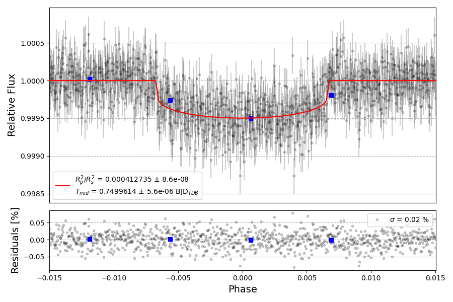

## Fit multiple light curves simultaneously with shared and individual parameters

- [Simultaneous airmass detrending](multiple_transit/Multiple_Lightcurve_fit.ipynb) (more robust but takes much longer)

- [Airmass detrending prior to simultaneous fit](multiple_transit/Multiple_Lightcurve_Fit_Detrended.ipynb)

The notebooks above are also compatible with TESS data! Just don't include an `a2` parameter for airmass detrending in the local bounds.

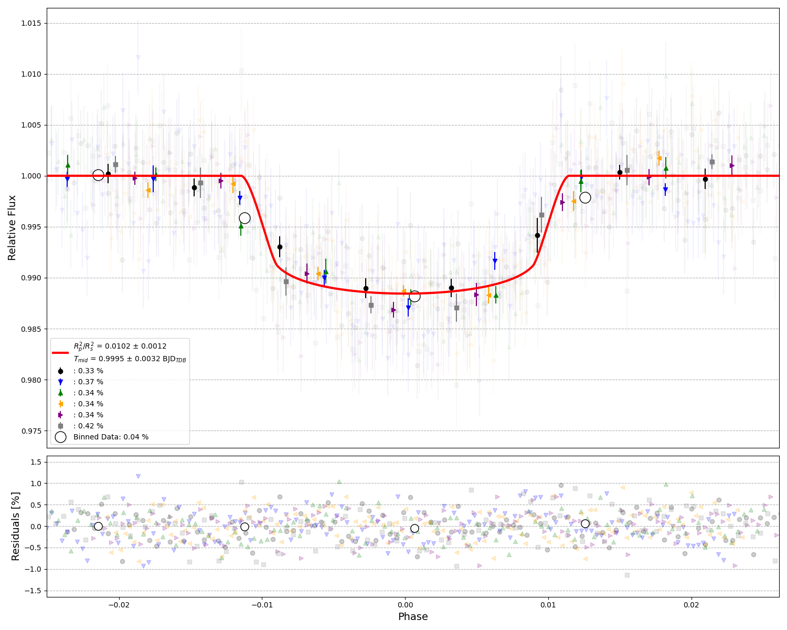
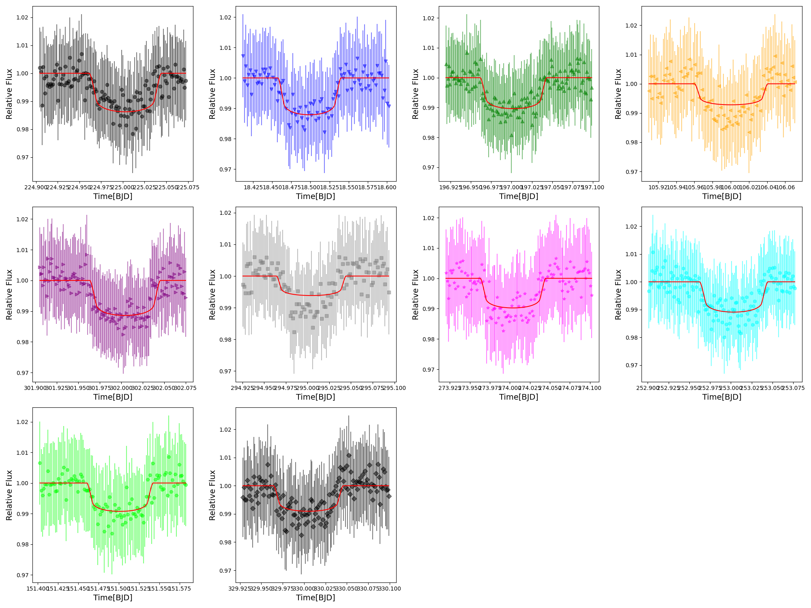

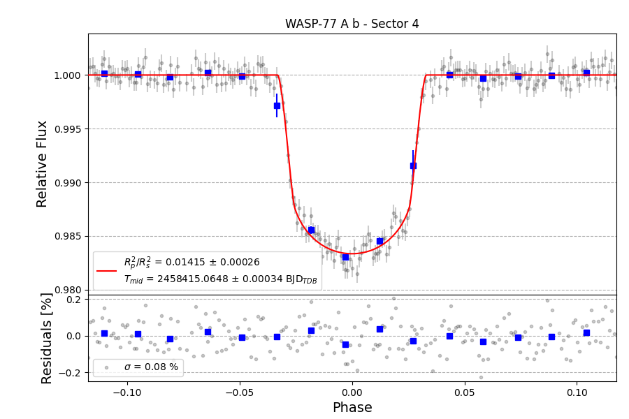

## [Ephemeris fitting](ephemeris/fit_ephemeris.py)
- Observed - Calculated plot with colors coded to data source

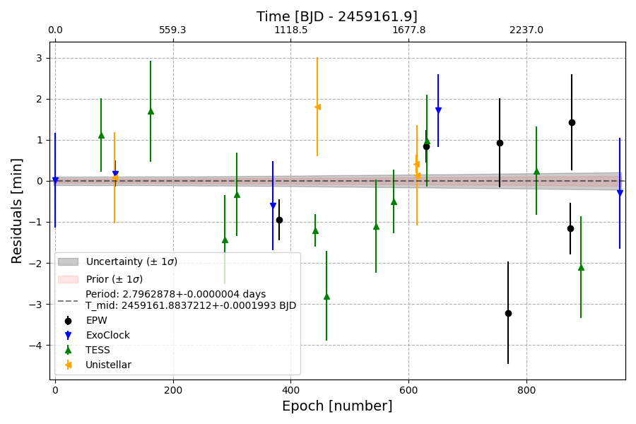

- [Orbital Decay](ephemeris/fit_decay.py)

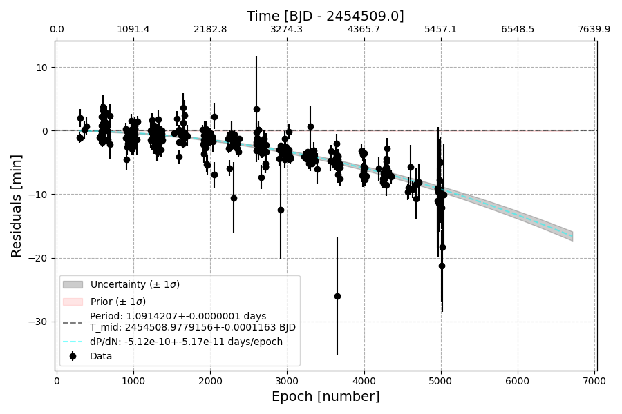
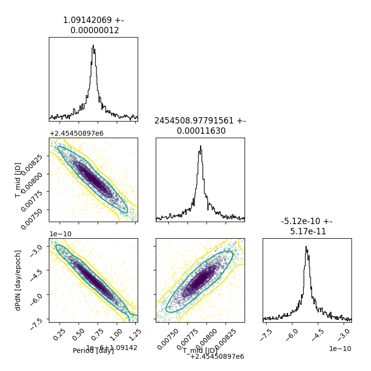

- Periodogram for transit timing search with up to two orders

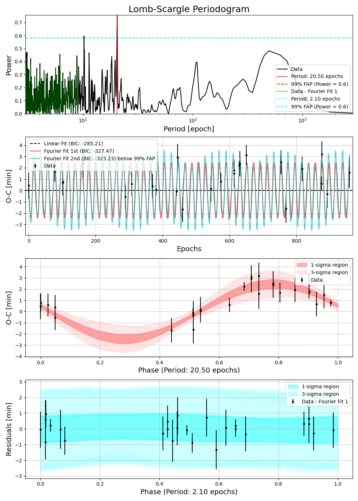

## [N-body interpretation of periodogram](nbody/README.md)

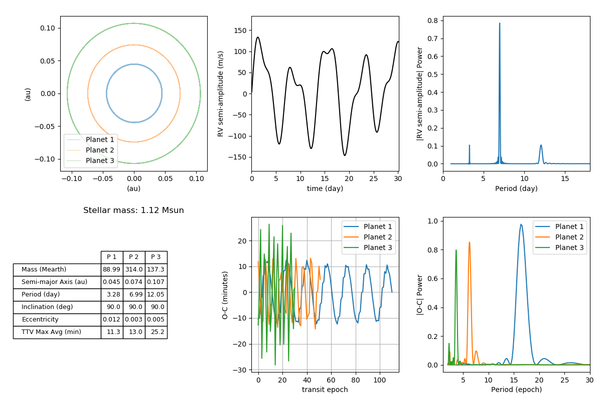

## [Radial Velocity](radial_velocity/rv_example.py)

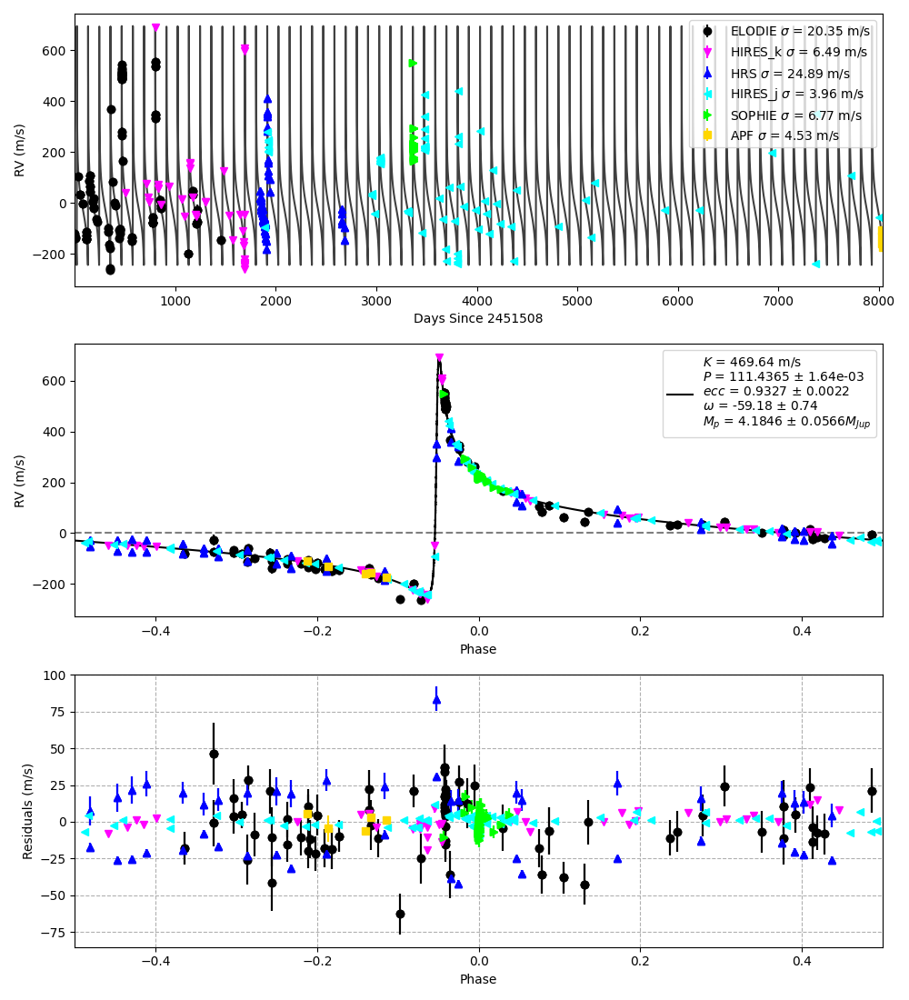

## [Joint Fit of Transit Photometry, Radial Velocity, and Ephemeris data (transit/eclipse times)](joint_rv_transit/joint_fit.py)

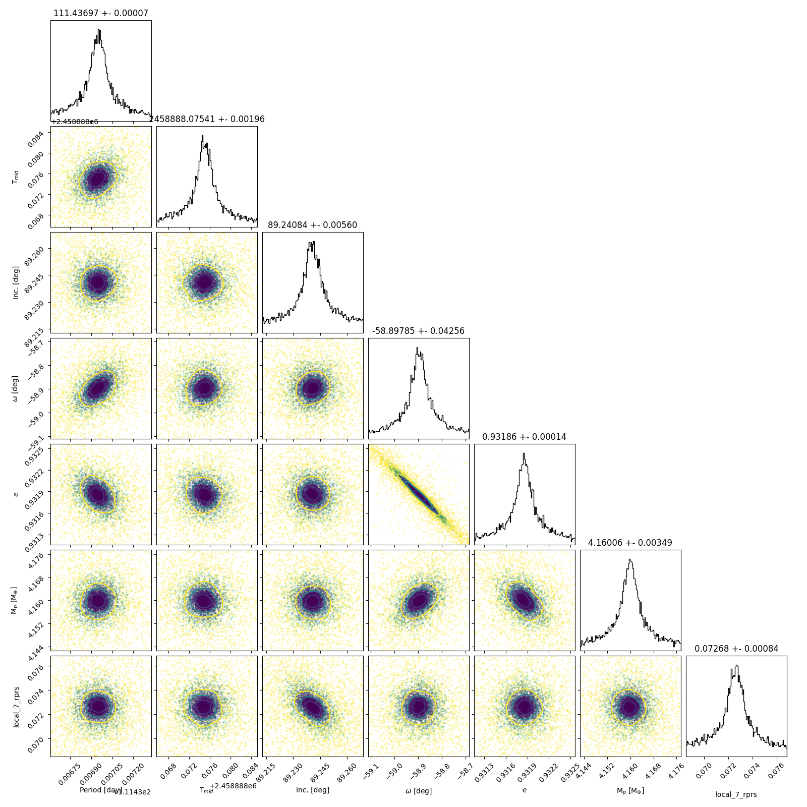

## [Joint Fit of Transit Photometry, Radial Velocity, and Ephemeris data (transit/eclipse times)](joint_rv_transit/joint_fit.py)

## [for_exotic_py_candidate_inits_maker.py](tess/candidates/for_exotic_py_candidate_inits_maker.py)

This script automates and enhances the process of generating initialization (inits) JSON files for candidate exoplanets specifically for use with exotic.py. It streamlines the preparation of inits files by interacting with the ExoFOP database and organizing the output data for easy integration with the EXOTIC pipeline.

Key Features:

Automated JSON File Download: Prompts the user to input a TIC ID, then automatically downloads the corresponding JSON file from ExoFOP.
Data Extraction and CSV Generation: Extracts relevant stellar and planetary parameters from the downloaded JSON files and compiles them into a comprehensive CSV file.
Inits JSON File Creation: Generates a JSON inits file tailored for use with exotic.py, with options to estimate missing parameters if necessary.
Directory Management: Organizes the storage of output files by dynamically creating directories for each TIC ID and candidate designation, ensuring consistent and clean file management.
File Location:
/EXOTIC/examples/tess/candidates/
The generated output files will be located in:
/EXOTIC/examples/tess/candidates/output_inits_files/for_exotic_py_candidate_inits_output_files/{tic_id}_file/{candidate_designation}_inits.json

## [for_toi_py_candidate_inits_maker.py](tess/candidates/for_toi_py_candidate_inits_maker.py)

This script enhances the generation of initialization (inits) JSON files specifically for use with toi.py and toi_indiv_lc.py. It automates the process by interacting with ExoFOP, organizing the output data, and streamlining the preparation of inits files.

Key Features:

Automated JSON File Download: Prompts the user to input a TIC ID and downloads the corresponding JSON file from ExoFOP.
Data Extraction and CSV Generation: Extracts and compiles relevant stellar and planetary parameters into a comprehensive CSV file.
Directory Management: Dynamically organizes output files for each TIC ID and candidate designation, ensuring consistent and clean file management.
File Location:

The generated output files will be located in:
/EXOTIC/examples/tess/candidates/output_inits_files/for_toi_py_candidate_inits_output_files/{tic_id}_file/{candidate_designation}_inits.json
TESS Light Curve Analysis

## [toi.py](tess/candidates/toi.py)
This script is used to process and analyze TESS light curve data for candidate exoplanets. It automates the process of downloading, fitting, and analyzing transit data. It is a modification from the script tess.py.

Key Features:

Automated Data Handling: Downloads and processes light curve data from TESS based on the provided initialization file (can be created with "for_toi_py_candidate_inits_maker.py").
Transit Fitting: Performs transit fitting and analysis using the provided parameters, generating visual and data outputs.
Output Management: Saves the results, including processed light curves and fitting results, in the specified output directory.
Usage:
To run the script:

Navigate to the directory containing the script:
cd /EXOTIC/examples/tess/candidates
Run the script with the following command:
python toi.py -i <input_inits_file_path> -o <output_directory_path>

## [toi_indiv_lc.py](tess/candidates/toi_indiv_lc.py)
This script is used to process and analyze TESS light curve data for candidate exoplanets. Unlike toi.py, which performs a global fit, toi_indiv_lc.py focuses on fitting individual light curves using the priors from an existing initialization file.

Key Features:

Automated Data Handling: Downloads and processes light curve data from TESS based on the provided initialization file (can be created with for_toi_py_candidate_inits_maker.py).
Transit Fitting: Uses provided priors to perform transit fitting and analysis on individual light curves, generating visual and data outputs without performing a global fit.
Output Management: Saves the results, including processed light curves and fitting results, in the specified output directory.
Usage:
To run the script:

Navigate to the directory containing the script:
cd /EXOTIC/examples/tess/candidates
Run the script with the following command:
python toi_indiv_lc.py -i <input_inits_file_path> -o <output_directory_path>
Example:

python toi_indiv_lc.py -i input_inits.json -o output_results/

## [TESS light curve generation](tess/tess_individ_lc.py)

The `tess_individ_lc.py` script allows for the extraction and fitting of individual exoplanet transits from TESS data without performing a global fit. This script is beneficial for users needing quicker access to individual light curve data for joint fit or individual light curve analysis with other Python tools like EXOTIC example notebooks.

- **Works with confirmed exoplanets.**
- **Created from `tess.py`. In `tess.py`, the global fit is performed first, and the derived parameters are used as priors in the individual fits. In `tess_individ_lc.py`, the NEA priors are used instead, potentially giving slightly different results.**
- **Outputs go to `tess/tess_individ_lc_output` folder.**