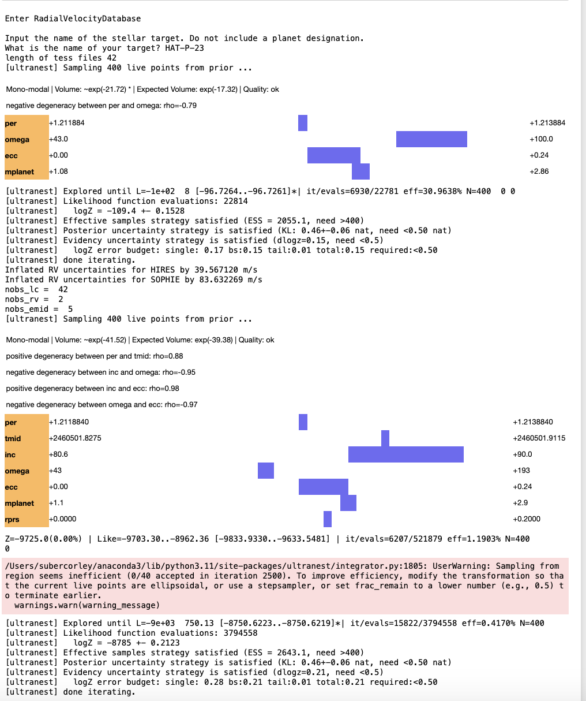
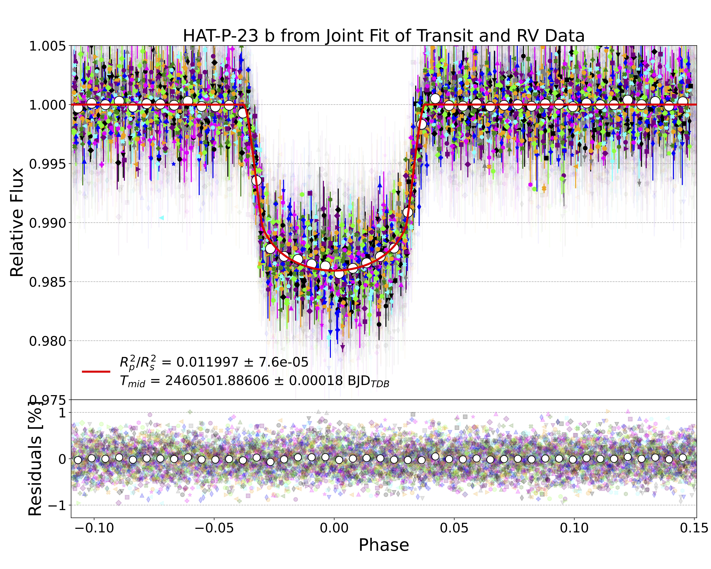
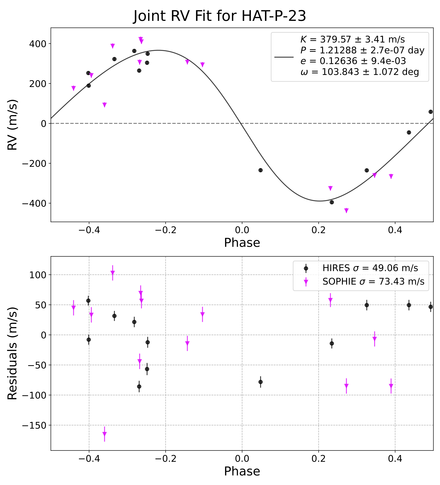
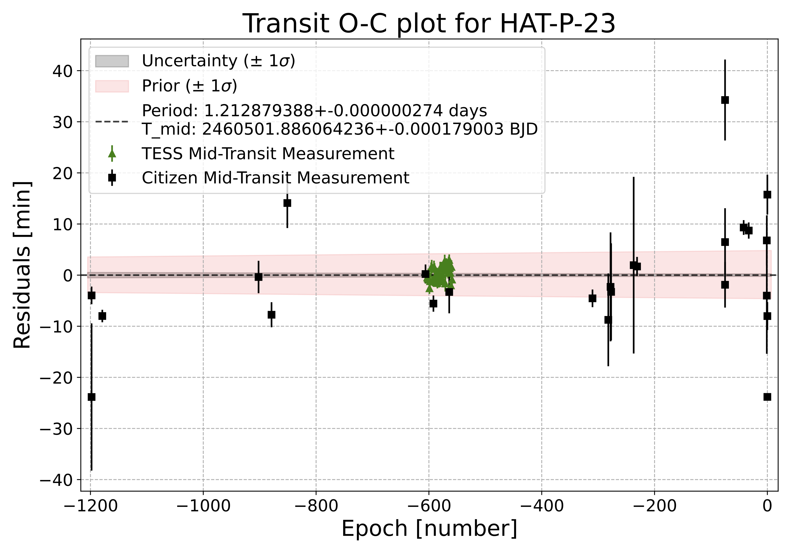
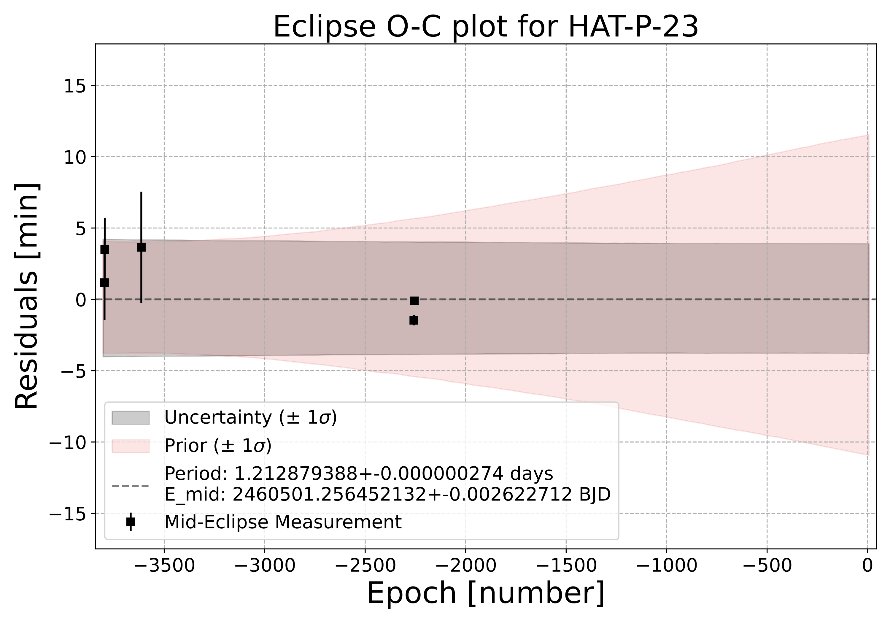

## JOINT Transit and Radial Velocity Fitting

The joint fit process occurs in two steps: a preliminary radial velocity fit and a full fit of citizen science, TESS, and eclipse data for a target. The radial velocity fit includes the four free parameters of period, eccentricity, omega (periastron), and planetary mass. The full fit includes the seven free parameters of the period, mid-transit time, inclination, omega, eccentricity, planetary mass, and the planetary radius to star radius ratio. 

Boundaries for the fits are established from prior uncertainties for each free parameter. A profile for uncertainty bands is established from historical or trial values that lead to convergence. The Ultranest reports of convergence and posterior fits determine when modifications need to be made for a specific free parameter. After the RV fit, the boundaries for the free parameters for the full fit are programmatically modified based on the results of the radial velocity fit.

While seven free parameters are allowed during the run, an assumption for a circular orbit can also be tested by commenting out the existing eccentricity and omega values. To determine the best model, BIC values (refer to Kyle’s formula from Slack)can be compared between the circular and elliptical orbits. Typically, stellar systems that are billions of years old are expected to have settled into a more circular orbit.

The joint fitting process and code used in this example for the stellar system HAT-P-23 were heavily adapted from previous work done for HD80606 (Pearson) and WASP-77A (Noguer). Regardless, improvements were made in the overall process to produce more and better radial velocity data that supports the refined ephemeris. 

## Radial Velocity Front-end

A front-end was developed to collect radial velocity data from six spectrographic sources: DACE, HIRES, NEID, HARPS, ESPRESSO, and SOPHIE. (Since DACE is the source of HIRES data from the discovery paper, DACE, HIRES, and SOPHIE are credited.) The others do not need credit but are mentioned as having been explored for potential data during the process.

In preparation for the joint fit, the radial velocity data were subjected to automated and visual quality checks. The automated checks included checking for consistency and usefulness of the collected data. Required parameters were present for all observations, such as reviews for R-M campaigns and subtractions for observations obtained before improvements at the source.

The quality assurance checks provided 13 good SOPHIE observations over the 13 HIRES radial velocity observations. 

## New Users

Below are the instructions for installing and running the JOINT fit code for the first time.

## Installation and Running

There are two Python Notebooks that drive the JOINT fit described above. All previous work on this process has been accomplished in an Anaconda environment. 

 **Locally On Your Own Computer**
  - Features: The RVDataCollector notebook manages the archive search for radial velocity data through various internet APIs and interfaces to limit the data stored on users' hard drives. The data retrieved by RVDataCollector is reduced into a normalized flat-file format and stored in ".CSV" files. All Data is read from the user's hard drive during the JOINT fit. 
  
  - Limitations: Requires user to install Python3 and install (or upgrade) EXOTIC. Users may also need to install some packages consumed in the Python notebooks.
  
  - Installation Instructions:
    1. ​[Download and install the latest release of Python.](https://www.python.org/downloads/)
        **NOTE FOR WINDOWS USERS:** Check the box "Add Python to PATH" when installing.
        **NOTE FOR ALL USERS:** Please download and install the latest release of Python, even if you have already installed a previous installation on your computer, to ensure that all Python packages are properly installed.
    2. [Download or upgrade to the latest release of EXOTIC.](https://github.com/rzellem/EXOTIC/releases)
    3. Unzip this file.
    4. Double-click on the appropriate installer for your operating system:
        - Windows: run_exotic_windows.bat
        - Macintosh: run_exotic_macintosh.command
        - Linux: run_exotic_linux.sh
    5. If you get a security warning about the software being from an unidentified, unsigned, or non-trusted developer, you can bypass it by:
        - Windows: click "More info" and then the "Run away" box at the bottom of the window.
        - Macintosh: Please follow [these instructions](https://support.apple.com/guide/mac-help/open-a-mac-app-from-an-unidentified-developer-mh40616/mac).

To run the example systems, the data, and all necessary parameters should have been loaded during the installation of EXOTIC. The folder EXOTIC on your hard drive will contain the necessary folders and files. Under the EXOTIC directory, locate the examples folder where code and data for the systems discussed here have been loaded. Also locate the exotic (small letters) folder where there are copies of py files that will be loaded into the Python site-packages directory

## Sample Data and Outputs
- The directory structure within EXOTIC for the JOINT fit code and data is:
  - EXOTIC
    - examples
      - joint_fit
        - criteria.tbl
        - grv_fitter_7_free_parms.ipynb
        - joint_oc_eclipse_plot.pdf
        - joint_oc_transits_plot.pdf
        - joint_posterior.pdf
        - joint_rv_fit_plot.pdf
        - joint_transit_plot.pdf
        - prv.cookies
        - radial_velocity
          - data
            - HAT-P-23_textfiles
              - ..._AAVSO.txt
              - ... (multiple files)
            - HAT-P-23.csv
            - WASP-77A_textfiles
            - ..._AAVSO.txt
            - ... (multiple files)
            - WASP-77A.csv
          - grv_fitter_params
            - HAT-P-23emidarray.csv
            - HAT-P-23priors.csv
            - HAT-P-23priorsarray.csv
            - HAT-P-23sigmas.csv
            - HAT-P-23TESSarray.csv
            - HAT-P-23tmidarray.csv
            - WASP-77Aemidarray.csv
            - WASP-77Apriors.csv
            - WASP-77Apriorsarray.csv
            - WASP-77Asigmas.csv
            - WASP-77ATESSarray.csv
            - WASP-77Atmidarray.csv
        - README.md (this file)
        - RVDataCollector.ipynb
        - targetlist.csv
    - exotic
      - api
        - joint_elca.py
        - rv_csv.py
        - rv.py

- **VERY IMPORTANT.** You must load your target data from your sources if you choose a target other than HAT-P-23. If you do so, your files must follow the pattern above where the target host star's name must be inserted into all folders and file names as shown here. In addition, the target name shown in these files and folder names must be supplied for the JOINT fit, and the RVDataCollector runs when you are asked for the target name. In addition, be aware that the target name you use must be resolvable by SIMBAD.

- The content of the example files in the "data" folder are:
  - target_textfiles contain TESS light curve data
  - target.csv files contain data that is collected by RVDataCollector from the six radial velocity sources discussed above

- The content of the example files in the "grv_fitter_params folder are:
  - HAT-P-23emidarray.csv
    - 2456117.91288,0.00271,Palomar O'Rourke 2014            
    - 2455895.95423,0.00181,Spitzer 3.6 um O'Rourke 2014 PI Heather Knutson Prog ID 80219
    - 2455897.16873, 0.00153,Spitzer 4.5 um O'Rourke 2014 PI Heather Knutson Prog ID 80219
    - 2457762.573776,0.000248,Spitzer 3.6 um Kyle Pearson 2024 PI Kevin Stevenson
    - 2457766.213359,0.000171,Spitzer 4.5 um Kyle Pearson 2024 PI Kevin Stevenson

  - HAT-P-23priors.csv
    - rprs,0.1169,0.0012,Bakos 2010
    - per,1.212884,0.000002,Bakos 2010                                                   
    - inc,85.1,1.5,Bakos 2010
    - u0,0.4163869898789653,0.0,exotethys - limb darkening (nonlinear) 
    - u1,0.08385912567010312,0.0,exotethys - limb darkening (nonlinear)
    - u2,0.3128291721930472,0.0,F. Noguer (March 08, 2024)
    - u3,-0.18203890672188036,0.0,F. Noguer (March 08, 2024)
    - ecc,0.106,0.044,Bakos 2010
    - omega,118.0,25.0,Bakos 2010
    - tmid,2460501.86952,0.00042,RHEC as most recent tmid from which to project
    - a1,1,0,transit airmass - not used
    - a2,0,0,transit airmass - not used
    - fpfs,0.5,0.0,F_p/F_s - for eclipse depth
    - rstar,1.203,0.074,Bakos 2010 R_sun
    - mstar,1.130,0.035,Bakos 2010 M_sun
    - mplanet,2.090,0.111,Bakos 2010 M_Jupiter
    - rv_linear,0,0,not used
    - rv_quad,0,0,not used

  - HAT-P-23priorsarray.csv
    - per,1.212884,0.000002,Bakos 2010
    - tmid,2454852.26464,0.00018,Bakos 2010            
    - emid,2456117.91288,0.00271,Palomar O'Rourke 2014 
    - ecc,0.106,0.044,Bakos 2010
    - omega,118.0,25.0,Bakos 2010
    - a,0.0232,0.0002,Bakos 2010
    - rstar,1.203,0.074,Bakos 2010

  - HAT-P-23sigmas.csv
    - tmid,100,
    - per,10,
    - inc,3,
    - omega,3,
    - ecc,3,
    - Mp,8,

  - HAT-P-23TESSarray.csv
    - 2459770.51948,0.0008,TESS
    - ...multiple files

  - HAT-P-23tmidarray.csv
    - 2459048.8538,0.0012,xxxx
    - ... multiple files

There is another very important file in the joint_fit folder: targetlist.csv. This file can be used with RVDataCollector by inputting the file name rather than the name of an individual target when the code asks for input of the target name. The targetlist.csv file contains the names of some 200 targets identified as potential targets for ARIEL and other missions later this decade and early in the next. As the example shows, any similar list can also be used so long as the fields in the file are comma-separated. 

- Outputs include information about the process of the convergence and plots of the results.
### Convergence of the Ultranest fit should begin to appear almost immediately and conclude after much of the processing is complete.
    
   
  
### The lightcurve plot of all transit data in the fit.    
 

### The posterior plot indicates how well the fit converged. Since inclination cannot physically exceed 90°,the upper boundary is fixed at that value and Ultranest clips the plot to indicate this result.

### The RV plot.

### The O-C plot for the transit.
 

### The O-C plot for the eclipse values.

 
*********************************************************
Please note that the HAT-P-23 run of grv_fitter_7_free_parms.ipynb is very long. It will take around 12 hours to complete depending on your local computer. The WASP-77A target, by contrast, runs much quicker
*********************************************************
