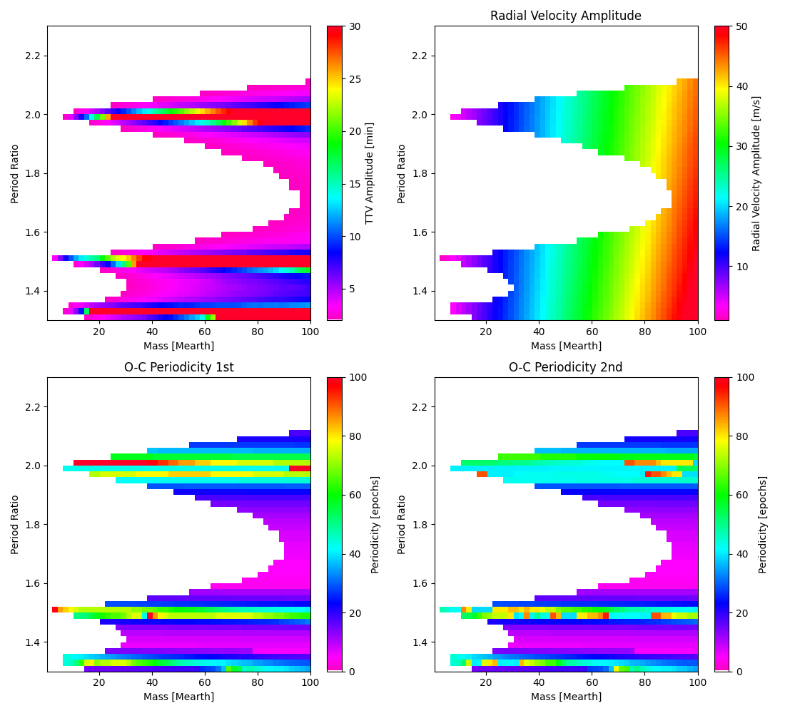

Coming soon to EXOTIC...

In the meantime checkout: https://github.com/pearsonkyle/Nbody-ai

Match your Lomb-Scargle periodicity to this chart to determine the mass and period of a potential outer planet. A digitized version of this plot is coming soon... Occasionally, the O-C perturbation will experience an additional periodicity with only a single perturber, it is suspected to be due to precession of the inner planet's orbit. For now, just worry about the 1st order solution when matching to your observations.

