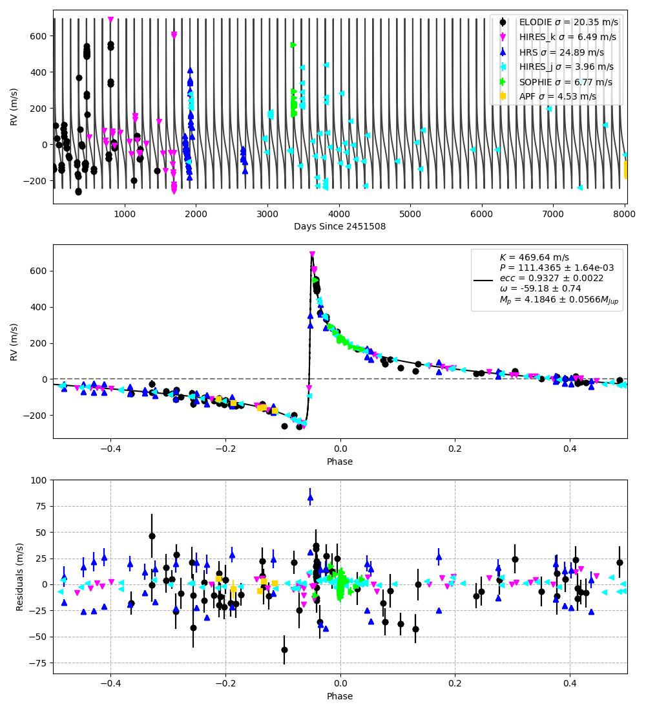
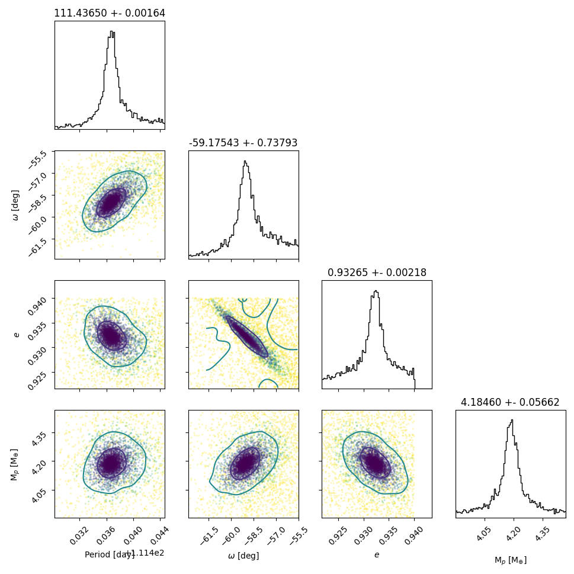

# Radial Velocity Fitting for a Single Planet



The software takes as input the stellar mass, planet mass, orbital period, eccentricity, argument of periastron, inclination, and stellar radius. It computes the planet's orbit over time using Kepler's equations, converting from orbital elements to Cartesian coordinates. The orbit is scaled by the planet/star mass ratio and stellar radius to estimate the star's motion. At each timestep, the velocity along the line of sight is computed by numerically differentiating the projected orbital position. This generates the radial velocity curve over time. The software can fit the computed radial velocity curve to observed measurements by optimizing the orbital parameters. Gaussian priors on stellar mass and radius can be incorporated. The joint modeling of transit photometry and radial velocities enables complete and self-consistent determination of the system parameters.

The underlying optimization code uses [Ultranest](), a Bayesian inference package that can be used to fit the radial velocity curve to observations. Since it estimates the Bayesian evidence during the sampling process it can be used for simultaneous model selection and posterior estimation.



The data points in each correlation plot are color coded to the likelihood with darker colors representing higher likelihoods. The contours represent the N-sigma boundary using the uncertainty reported in each column's title.


## HD80606 Use Case

The archival and new radial velocity measurements were analyzed using a joint fit between the TESS light curve and historical mid-transit/eclipse data to constrain a consistent 20-year orbital solution. The radial velocity model uses the same Keplerian orbital equations as the transit model ([PyLightcurve](https://github.com/ucl-exoplanets/pylightcurve); Tsiaras et al. 2016). The planet's orbit is projected onto a Cartesian grid for the transit geometry. The star's velocity is estimated by scaling the planet's orbit, assuming a two-body system where gravity balances centripetal acceleration. The velocity vector is projected along the line of sight to produce the RV signal. The velocity is estimated by evaluating the orbit equation twice to compute a numerical derivative. The planet's orbit is scaled by the mass ratio to mimic stellar motion and by stellar radius to acquire velocity units. One can also impose a Gaussian prior on stellar radius to reflect literature values and accounts for a degeneracy with inclination.

You can also plot the acceleration of the star which is useful for planning observations


## Citation 

For more information regarding the code and its use, please see the paper: https://ui.adsabs.harvard.edu/abs/2022AJ....164..178P/abstract

If you make use of this code, please cite the paper above.

```bibtex
@ARTICLE{2022AJ....164..178P,
       author = {{Pearson}, Kyle A. and {Beichman}, Charles and {Fulton}, B.~J. and {Esposito}, Thomas M. and {Zellem}, Robert T. and {Ciardi}, David R. and {Rolfness}, Jonah and {Engelke}, John and {Fatahi}, Tamim and {Zimmerman-Brachman}, Rachel and {Avsar}, Arin and {Bhalerao}, Varun and {Boyce}, Pat and {Bretton}, Marc and {Burnett}, Alexandra D. and {Burt}, Jennifer and {Cynamon}, Charles H. and {Fowler}, Martin and {Gallego}, Daniel and {Gomez}, Edward and {Guillet}, Bruno and {Hilburn}, Jerry and {Jongen}, Yves and {Kataria}, Tiffany and {Kokori}, Anastasia and {Kumar}, Harsh and {Kuossari}, Petri and {Lekkas}, Georgios and {Marchini}, Alessandro and {Meneghelli}, Nicola and {Ngeow}, Chow-Choong and {Primm}, Michael and {Samantaray}, Subham and {Shimizu}, Masao and {Silvis}, George and {Sienkiewicz}, Frank and {Swain}, Vishwajeet and {Tan}, Joshua and {Tock}, Kal{\'e}e and {Wagner}, Kevin and {W{\"u}nsche}, Ana{\"e}l},
        title = "{Utilizing a Global Network of Telescopes to Update the Ephemeris for the Highly Eccentric Planet HD 80606 b and to Ensure the Efficient Scheduling of JWST}",
      journal = {\aj},
     keywords = {Exoplanets, Observational astronomy, Orbit determination, 498, 1145, 1175, Astrophysics - Earth and Planetary Astrophysics, Astrophysics - Instrumentation and Methods for Astrophysics},
         year = 2022,
        month = nov,
       volume = {164},
       number = {5},
          eid = {178},
        pages = {178},
          doi = {10.3847/1538-3881/ac8dee},
archivePrefix = {arXiv},
       eprint = {2208.14520},
 primaryClass = {astro-ph.EP},
       adsurl = {https://ui.adsabs.harvard.edu/abs/2022AJ....164..178P},
      adsnote = {Provided by the SAO/NASA Astrophysics Data System}
}
```